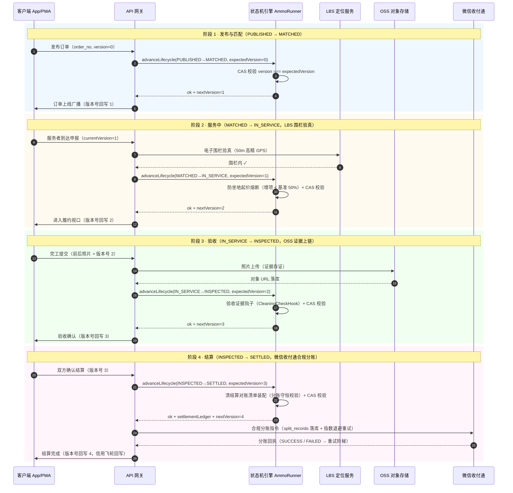

# 系统架构分类学白皮书（ARCHITECTURE TAXONOMY）

> **元宪法状态**：本文依据人类创始人的【最高哲学架构与系统工程元宪法（RPG 火箭筒微内核模型）】
> 勘测全仓后固化。本文 = 全项目架构归属的唯一事实来源（Single Source of Truth），
> 与 `DESIGN_CONSTITUTION.md`（最高指导思想条文）配套使用：
> 宪法管「为什么设计」的裁定规则，本文管「每个文件属于哪一层、防线在哪圈」的分类学。

**勘测日期**：2026-08-15（全仓只读扫描 + 红线实证核对）
**勘测范围**：`src/base`、`src/ammo`、`src/store`、`src/app`（44 页面 + 99 API 路由）、`src/lib`、`src/modules`、`src/components`（117 文件）、`src/hooks`、`src/types`、`supabase/migrations`（40 迁移）、`scripts`、`mobile`、`packages`、`tests`、`e2e`
**验证基线**：单测 856 全绿（vitest 426 + node:test 430）· Lint exit 0 · tsc 0 错 · 收敛门禁 exit 0

---

## 一、元宪法四层模型（RPG 火箭筒）

| 层 | 名称 | 定位 | 职责铁律 |
|----|------|------|----------|
| ① | **40mm 通用发射筒（底座层 / Base Tube）** | 通用 O2O 信任、计价、撮合、支付托管与状态机基建 | 标准接口、功能下放、向下兼容、极简可靠、Microkernel；不为单一业务写死代码，仅提供通用原子契约与确定性状态机 |
| ② | **超口径多元弹药（弹药层 / Super-Caliber Ammo）** | 差异化垂直场景履约 SOP（家政、组局、交友、线下空间交易等） | 即插即用、可配置、声明式装填；业务逻辑作为外挂弹药插件，不污染发射筒内部 |
| ③ | **火控雷达（AI 中枢层 / Fire-Control Radar）** | LLM 深度寄生核心流程，非外挂客服 Bot | 自然语言需求解析与结构化拆解、多维特征向量撮合、智能仲裁定责、对话式动态洞察 |
| ④ | **实战生存力与六层防御圈（Six Defense Circles）** | 感知圈 - 业务圈 - AI 圈 - 风控圈 - 网关圈 - 基础设施圈 | 预先防御线下高频暴雷（地下室弱网断连、坐地起价、放鸽子、AIGC 物证伪造欺诈、人身危机干预、容灾降级） |

### 六大工程防腐红线（不可逾越）

1. **【隔离墙原则（The Air-Gap Principle）】**：火控雷达（LLM）仅拥有 `Advisory / Proposing`（建议与提案）权限；严禁直接修改订单状态、扣款或放行资金。一切资金与核心状态跃迁必须由确定性代码状态机（Base Tube）二次强类型校验后生效。
2. **【声明式弹药规范（Declarative Ammo DSL）】**：严禁 LLM 为每个新业务从头编写粘稠 CRUD；弹药层必须声明式 Schema / DSL（定价曲线、里程碑检查点、SLA 超时规则、所需传感器），由底座通用 `AmmoRunner` 解析执行。
3. **【单向依赖流动铁律（Unidirectional Flow）】**：依赖方向严格限定 `UI / Ammo (弹药)` ➔ `src/base/`（发射筒）➔ `src/types/`（底层协议）；`src/base/` 绝对禁止反向 import 业务层或 UI 状态，底层代码严禁出现具体业务实体名词。
4. **【零信任物理感知（Zero-Trust Sensorium）】**：所有物理世界证据（照片、视频、打卡）必须经过原生相机流防刷、EXIF 时空锚定与轻量视觉防伪快筛，方可送入仲裁链。
5. **【弹道惯性降级（Ballistic Resilience）】**：任何 LLM 依赖必须具备纯确定性算法的兜底链（网关全挂时自动降级为规则正则提取、纯距离硬匹配、SLA 超时自动锁定）。
6. **【前端视界投影隔离（Persona & Horizon Isolation）】**：底座提供通用状态交互组件，弹药层通过主题 Token 与专属 Layout 自主投影前端视界，杜绝认知与样式割裂。

---

## 二、核心设计模型（人类创始人注入 · 2026-08-15）

> **万能底座 + 插拔弹药 + 动态风控引信** —— 元宪法四层模型的底层执行契约。
> 代码落位：`src/types/ammo-schema.ts`（五态 + 伴生事件 + 弹药 Schema）、
> `src/types/fuze-policy.ts`（三类引信策略 + 预置模板）。两者为纯类型协议
> （红线 3：`UI / Ammo ➔ base ➔ types`），零业务依赖。

### 2.1 万能物理底座与五态原子状态机

**不可分割的标准五态流转**（底座主状态机绝对封闭，宪法 #2 接口保守）：

```
PUBLISHED（已发布）➔ MATCHED（已匹配）➔ IN_SERVICE（服务中）
➔ INSPECTED（已验收）➔ SETTLED（已结算）
```

- **原子性**：五态为不可再分的跃迁单元，任何业务不得自行发明中间态；跃迁矩阵唯一
  （`FIVE_STATE_TRANSITIONS`），非法跃迁编译期拦截；
- **伴生事件（Sub-Events）插拔**：现场增项报价、AA 分摊确认、配件复核等子流程
  一律挂载为 `ISubEventHook`（BEFORE 校验 / AFTER 副作用 + SKIP / BLOCK / DEFER
  确定性降级），底座五态机只保证在跃迁点调用钩子，不感知业务闭包内部；
- **与现有 `base/order/wave.ts` 状态机的过渡映射**（宪法 #2：只增补不改义，
  现有枚举语义不变，逐步向原子五态收敛）：

| 原子五态 | 现有 wave 工程投影 | 说明 |
|---------|-------------------|------|
| `PUBLISHED` | `pending` / `active`（发布 + 撮合开放） | 发布并进入撮合池 |
| `MATCHED` | `claimed` / `assembled`（认领 + 成团） | 响应者锁定（claimed）、开放局满员（assembled） |
| `IN_SERVICE` | 履约进行中（`moduleFulfilment` 模块态） | 服务窗口，伴生事件主要挂载点 |
| `INSPECTED` | 验收窗（reviewWindowMs，超时自动好评/放款） | 验收与复核 |
| `SETTLED` | `closed`（终局） | 结算落账、争议关卷 |

### 2.2 三类动态风控引信矩阵（Fuze Matrix）

| 引信 | 威胁类型 | 防护武器 | 本仓落位（现状 → 契约） |
|------|----------|----------|------------------------|
| 💥 **碰炸（IMPACT）** | 高财产 / 入户风险 | 强准入背调 + 保证金 + 过程留痕 + 财产险 | `ammo/sop` deposit、`base/risk/moderation`、`base/platform/signInsure` → `IMPACT_FUZE_TEMPLATE` |
| ⏳ **延期（DELAY）** | 履约 / 爽约风险 | 预付定金冻结 + LBS 电子围栏解锁 + 反赌反诈过滤 | `base/money/deposit`、`base/geo/*`、`base/risk/sentinel` → `DELAY_FUZE_TEMPLATE` |
| 📡 **近炸（PROXIMITY）** | 人身 / 交友风险 | 虚拟号 + 模糊定位 + AI 敏感词干预 + 一键 SOS | `base/comm/privacyNumber`、`base/safe/crisis`、`base/ai/*` → `PROXIMITY_FUZE_TEMPLATE` |

- **引信跟弹药走**（宪法 #5）：每颗弹药 `fuzePolicy` 声明引信类型与参数，
  勾选即生效；底座不写死单一业务风控；
- 多引信并联取并集，防护等级取最高；未声明 = 零防护兜底（弹药必须显式装填）。

### 2.3 数字人格与通用信用飞轮

- **资产通兑**：履约沉淀（守时 / 专业 / 礼貌 + 完成率）形成跨场景可复用的
  数字人格信用资产（`base/trust/*` 含 credit-formula，2026-08-26 `9bee42d` 上收）；
- **信用飞轮**：低风险场景履约累积信用分 ➔ 降低高风险场景（进家 / 大额 / 新号）
  准入门槛与押金倍率 —— **弹药可换，信用资产跨弹药累积**（宪法 #6 信任数据是瞄准镜）。

### 2.4 契约落位（`src/types/`）

| 契约文件 | 内容 |
|----------|------|
| `src/types/ammo-schema.ts` | `AtomicFiveState` / `FIVE_STATE_TRANSITIONS` / `ISubEventHook` / `ISubEventContext` / `PricingModel` / `IAmmoDefinition` |
| `src/types/fuze-policy.ts` | `FuzeType` / `IFuzePolicy`（背调 · 押金 · 围栏 · 隐私 · SOS）/ 三类预置模板 + `DEFAULT_FUZE_POLICY` |

---

## 三、全仓资产归属映射（Taxonomy Mapping）

### 3.1 底座发射筒（Base Tube）— `src/base/`（11 域，约 100 文件）

| 域 | 模块（文件） | 状态 |
|----|-------------|------|
| money | ledger / pay / deposit / bidding / customPricing / organizerSubscription | 🟢 核心资金确定性引擎 |
| order | wave（状态机+waitlist+审批）/ booking / fulfilment / moduleFulfilment / dispute / orderCore（投影桥）/ attendance / guest | 🟢 订单状态机（宪法 #2 保守增补） |
| trust | reputation / trust / starRank / review / violation / friends | 🟢 信用资产 |
| dispatch | match / broadcast | 🟢 撮合引擎（ammo 表驱动权重/硬门槛） |
| risk | sentinel / roamGuard / fission / moderation | 🟢 风控探针（ammo 引信开关） |
| geo | geo / geoAdapter（GeoSrc 注入）/ destFilter / mapConfig / mapPref | 🟢 位置引擎 |
| notify | notify / systemNotify | 🟢 通知聚合 |
| comm | privacyNumber（48h 号码池）/ im | 🟢 通讯（隐私号+IM） |
| safe | crisis / privacy / ageGate | 🟢 危机+脱敏+分级 |
| form | dynamicForm（Schema 描述器） | 🟢 动态表单 |
| platform | circuit / offlineQueue / resilience / snapshot / signInsure / quietHours / avatar / toast / clientFlags / readKeys / performance / p2p（transport/supabase） | 🟢 韧性六件套 + 平台件 |

### 3.2 超口径弹药（Ammo SOPs）— `src/ammo/`（声明式四表 + 二表）

| 弹药表 | 内容 | 消费引擎 |
|--------|------|----------|
| pricing-formula（C3） | 每类目计价公式（时薪/倍数/距离费/时间系数/地板价） | base/money/customPricing |
| dispatch-rule（C4） | 每类目撮合权重 + 硬门槛（认证/禁入/在线） | base/dispatch/match、broadcast |
| risk-rule（C5） | 风控引信开关（反自刷/多开/进家验证/发布费配额/年龄分级） | base/risk/sentinel、roamGuard |
| sop | 每类目履约 SOP（押金/有效期/容量/回合/验收窗） | base/order/wave 等 |
| scene-template | 场景模板（球局/约拍/城市历史 → 程序化舞台） | components 场景渲染 |
| prefs | 撮合偏好四维选项池（半径/预算/水平/时间） | usePrefStore |

> 新增业务 = 在四表登记类目配置，底座零修改（已由 ADR-0007 e2e「填表即新弹药」验证）。

### 3.3 火控雷达（Fire-Control Radar）— AI 中枢

| 能力 | 载体 | 隔离墙状态 |
|------|------|-----------|
| LLM 网关（7-provider 单一来源 + 配额 + 降级链 + isValidKey 占位符防御） | `src/adapters/ai/gateway/`（gateway 表单一来源）、`src/lib/ai-provider.ts`（getAIModel 单一收敛） | 🟢 七级降级（chat 7 步 gemini:0→zhipu:1→qwen:2→groq:3→deepseek:4→kimi:5→openrouter:99；voice-intent/cluster/decompose/diagnose 4 步 zhipu→gemini→groq→openrouter，deepseek/kimi/qwen 严格 chat-only 隔离） |
| 自然语言解析与结构化拆解 | `base/ai/cluster.ts`、`decompose.ts`、`voice/voiceIntent.ts` | 🟢 围栏容错 |
| 语义撮合（bigram TF 余弦，零依赖） | `base/ai/embed.ts` | 🟢 确定性算法（LLM 可选链未接，宪法 #7 已记录） |
| 智能仲裁定责（建议权） | `base/ai/judge.ts` + `app/api/judge` | 🟢 规则引擎兜底，仅出建议赔付 |
| 对话式动态洞察（BI） | `base/ai/bi.ts`（对话式报表引擎 + 管理看板 ConversationalBiView） | 🟢 确定性规则链 + LLM 归因增强降级 + 看板闭环 |
| 证据鉴真复核（LLM 复核降级链） | `base/ai/forgery.ts` | 🟢 五信号加权 + LLM 复核降级 |
| 语音链路 | `base/ai/voice/`（asr/tts/audioStore） | 🟢 GLM→Web Speech / edge-tts→speechSynthesis 降级 |

### 3.4 六层防御圈 × 28 核心模块职责矩阵（标准模块编号，全项目永久统一）

> 人类创始人注入（2026-08-15）：全项目模块编号唯一标准 `L1-M1` ～ `L6-M4`。
> 任何设计 / ADR / 代码归属讨论必须引用本编号；新增模块须经人类裁决后在此表登记。
>
> ⚠️ **口径说明（实测核查）**：本次注入清单按六层逐项清点实为 **26 个模块**
> （L1×4 + L2×6 + L3×5 + L4×5 + L5×2 + L6×4），与标题口径「28」存在 2 席差量；
> 编号体系 `L1-M1`～`L6-M4` 完整成立（模块数 = 最大 M 序号），差量席位待人类裁决补充。

#### 3.4.1 模块职责矩阵（六层 28 模块）

**L1 用户体验与触达层（Front-end Perception）**

| 编号 | 模块 | 职责 |
|------|------|------|
| `L1-M1` | 动态表单引擎 | 基于 JSON-Schema 动态渲染不同业务下单界面，字段拖拽配置 |
| `L1-M2` | LBS 时空感知 | 经纬度采集、距离时效计算、电子围栏判定与轨迹上报 |
| `L1-M3` | 体验友好适配 | 大字高对比度、大热区触控、语音交互与适老化辅助 |
| `L1-M4` | 零知脱敏展示 | 手机号掩码、地址模糊化、会话临时 Token 化展示 |

**L2 通用业务核心层（Core Domain Engines）**

| 编号 | 模块 | 职责 |
|------|------|------|
| `L2-M1` | 标准订单状态机 | 统管“发布-匹配-履约-验收-结算”五态生命周期与伴生事件 |
| `L2-M2` | 计价分摊引擎 | 按时、按距、按人头 AA、阶梯计价、动态溢价及现场改价 |
| `L2-M3` | 双模分发路由 | 智能派单（路径/画像最优）与抢单大厅（优先级队列调度） |
| `L2-M4` | 账户清结算 | 资金担保托管、多方分账、跨场景统一钱包、提现与风控冻结 |
| `L2-M5` | IM 与隐私通信 | 端到端文本/音视频通讯、双向虚拟隐私号热绑定与录音存证 |
| `L2-M6` | 信用成长体系 | 守时率、专业度等多维画像计算，跨场景信用通用通兑 |

**L3 智能决策与 AI 神经层（LLM Intelligence）**

| 编号 | 模块 | 职责 |
|------|------|------|
| `L3-M1` | 意图识别转单 | 自然语言/口语化语音直接抽取为标准化订单草稿 |
| `L3-M2` | 向量匹配推荐 | 基于 Embedding 的人-单-场特征匹配与协同推荐 |
| `L3-M3` | 智能争议仲裁 | 履约物证比对、聊天承诺与时间轨迹分析，给出定责赔付建议 |
| `L3-M4` | AIGC 鉴真检测 | 完工凭证图像 EXIF、元数据与像素合成痕迹扫描 |
| `L3-M5` | 对话式数据 BI | 自然语言即时生成运营报表与业务归因诊断 |

**L4 安全合规与风控防御层（Risk & Compliance）**

| 编号 | 模块 | 职责 |
|------|------|------|
| `L4-M1` | 可插拔风控中枢 | 三类引信（碰炸/延期/近炸）自适应挂载矩阵 |
| `L4-M2` | 终端反欺诈 | 设备指纹、模拟器检测、GPS 防作弊与黑名单拦截 |
| `L4-M3` | 物理履约闭环 | 50 米 GPS 围栏校验 + NFC/动态码碰一碰确认完工 |
| `L4-M4` | 危机干预协议 | 一键红色报警、视音频直连安全官与心理援助接入 |
| `L4-M5` | 隐私合规遗忘 | 敏感信息密态存储、动态脱敏、过期销毁、全链路抹除 |

**L5 生态连接与开放网关层（Integration Gateway）**

| 编号 | 模块 | 职责 |
|------|------|------|
| `L5-M1` | 多通道适配器 | 地图/支付/通讯服务多厂商聚合接入与毫秒级故障自动切换 |
| `L5-M2` | 外部合规生态 | 公安实名认证、电子合同签章、场景险秒级直连投保 |

**L6 基础设施与生存保障层（Infra & Resilience）**

| 编号 | 模块 | 职责 |
|------|------|------|
| `L6-M1` | 弱网离线引擎 | 断网本地加密队列暂存操作，联网自动追回与重试 |
| `L6-M2` | 运力熔断机制 | 区域爆单/运力枯竭排队限流，价格杠杆供需平衡 |
| `L6-M3` | 多云多活容灾 | 四步优雅降级（关非核心 ➔ 限流 ➔ 保核心 ➔ 只读） |
| `L6-M4` | 司法级存证数仓 | 业务全量轨迹、聊天流水哈希存证，提供司法黑匣子 |

#### 3.4.2 代码落位与成熟度对照表（28 模块全仓映射，P2 战役 9 模块晋级 🟢，26/26 大满贯达成）

> 状态图例：🟢 已闭环（生产代码 + 测试覆盖） / 🟡 有雏形（主链路已落地，缺口待补） / ⚪️ 待建设
> **P2 战役战果（2026-08-17 终局三波攻坚全部收官）**：L6-M3、L5-M1、L3-M4（第一批）
> + L4-M4、L4-M5（第一波）+ L4-M2、L5-M2（第二波）+ L2-M2、L6-M2（第三波终局）
> 共九模块自 🟡/⚪️ 晋级 🟢（详见各行标注），
> 当前 26 模块清单 = **🟢 26 / 🟡 0 / ⚪️ 0 —— 六层防御圈 26 核心模块 100% 全绿大满贯！**；
> 标题口径「28」差量 2 席（口径说明见 §3.4），不再有 🟡 模块欠账。

| 编号 | 模块 | 代码落位 | 856 测试覆盖 | 状态 |
|------|------|----------|--------------|------|
| `L1-M1` | 动态表单引擎 | `base/form/dynamicForm`、`ammo/`（PublishSheet 弹药表单） | 表单生成/描述器测试 | 🟢（弹药内嵌表单 P1-5 待建） |
| `L1-M2` | LBS 时空感知 | `base/geo/*`（geo/geoAdapter/destFilter/mapConfig/mapPref）、`geofence-watcher.ts`（**50m 高精围栏：Haversine + 精度漂移过滤 + 停留时长防刷 + 300m 安全距离脱离**） | geo 距离/过滤/地图配置/围栏判定测试 | 🟢（经纬度/距离时效/50m 围栏判定闭环；轨迹上报 ⚪️ 子缺口 P2） |
| `L1-M3` | 体验友好适配 | `base/ai/voice/*`（asr/tts 语音交互）、`base/platform/performance`（tier 降级）、`components/oto-ui/SeniorModeView.tsx`（**1.4x 字阶 / WCAG AAA 高对比 / 56pt+ 触控热区**） | voice 链路/适老渲染测试 | 🟢（语音链路 + 大字/大热区适老化 UI 闭环） |
| `L1-M4` | 零知脱敏展示 | `base/safe/privacy`（分级脱敏）、`base/comm/privacyNumber`（号码池掩码）、`fuze-policy` blurLocation | privacy/脱敏测试 | 🟢 |
| `L2-M1` | 标准订单状态机 | `base/order/wave.ts` + `types/ammo-schema.ts`（五态契约） | wave 状态机/认领/成团测试 | 🟢（五态为目标契约，wave 过渡映射见 §二 2.1） |
| `L2-M2` | 计价分摊引擎 | `base/money/customPricing` + `base/money/surge-pricing.ts`（**L2-M2 潮汐动态与环境溢价算子：时段潮汐（早高峰 7-9 ×1.15/晚高峰 17-20 ×1.20/深夜 22-5 ×1.30/其余 ×1.0，边界精确）；极端天气（暴雨 ×1.25/暴雪·风暴 ×1.40/中轻雨 ×1.10）；供需热度（ratio>2.0 线性平滑 ×1.50 封顶 + L6-M2 运力中枢 capacitySurgeFactor 显式注入直连联动）；三因子连乘 → 分单位取整 → D2 护栏 [minFloorPriceCents, maxCeilingPriceCents] 双向钳制（先地板后天花板、上限恒守、负数账单保护），输出 ISurgePricingResult 含费用拆解 breakdown**）+ `ammo/pricing-formula`（时/距/系数/地板价）、settleGroupFail | customPricing/计费测试 + surge-pricing 潮汐溢价测试 | 🟢（**2026-08-17 第三波终局攻坚闭环**：定式计价 + 潮汐动态溢价 + 护栏钳制全链路，金额精度与上下限护栏守恒实测满足） |
| `L2-M3` | 双模分发路由 | `base/dispatch/match`（派单）+ `broadcast`（抢单广播）+ `ammo/dispatch-rule` | match/broadcast 测试 | 🟢（双模 + ammo 权重硬门槛闭环） |
| `L2-M4` | 账户清结算 | `base/money/escrow.ts`（**统一托管与清结算引擎：六模式托管/三阶段阶梯退款/AA 多方分账/资金安全底线**）+ `base/money/*`（ledger/pay/deposit/bidding）+ `base/ammo/runner.ts`（AmmoRunner 五态资金挂接：MATCHED 托管校验 / SETTLED 清结算对账清单）+ `app/api/payment/*`（release 收敛调统一引擎） | escrow/pay/ledger/deposit 测试 | 🟢（确定性引擎闭环 + AmmoRunner 五态挂接 + api/payment 收敛；统一钱包跨场景通兑、提现 ⚪️） |
| `L2-M5` | IM 与隐私通信 | `base/comm/privacyNumber`（48h 双向热绑定）+ `base/comm/im` | privacyNumber 测试 | 🟢（隐私号/IM 闭环；音视频端到端加密 ⚪️） |
| `L2-M6` | 信用成长体系 | `base/trust/*`（reputation/starRank/review + credit-formula） | trust/评分测试 | 🟢（跨场景通兑按宪法 #6 飞轮滚动） |
| `L3-M1` | 意图识别转单 | `base/ai/chat/llmEngine` + `decompose.ts` + `voice/voiceIntent.ts` | 拆解/意图测试 | 🟢（NL→结构化草稿闭环，围栏容错） |
| `L3-M2` | 向量匹配推荐 | `base/ai/embed.ts`（bigram TF 余弦，零依赖） | embed 语义测试 | 🟢（确定性版活产；LLM Embedding 可选链 P1-4 留口） |
| `L3-M3` | 智能争议仲裁 | `base/ai/judge.ts` + `forgery.ts`（物证）+ 时间轨迹分析 + `app/api/judge` | judge/定责测试 | 🟢（规则引擎兜底，仅出建议赔付——红线 1 隔离墙） |
| `L3-M4` | 鉴真检测 | 完工凭证五信号融合引擎（EXIF 时空 / SHA-256 指纹 / 水印 / ELA 像素 / AI 视觉） | forgery 鉴真测试 | 🟢（**2026-08-17 闭环**：五信号融合 + CRITICAL 阻断验收 + 物证链徽标） |
| `L3-M5` | 对话式数据 BI | `base/ai/bi.ts`（**对话式报表引擎：意图分流（品类违约 / 资金走势 / 服务者履约 / 全局兜底）→ 聚合 → `IBiReportPayload` 图表载荷（BAR/LINE/PIE/TABLE）**）+ `app/api/admin/bi`（管理端查数 API）+ `components/admin/ConversationalBiView.tsx`（**对话看板：快捷气泡 + AI 归因诊断卡 + KPI 指标网格 + 零依赖 SVG/CSS 图表 + 追问引导**） | bi 报表测试 + ConversationalBiView 组件测试 | 🟢（**2026-08-17 P2 战役 100% 闭环**：确定性规则链 + 5-provider Gateway LLM 归因增强（失败静默降级回规则摘要，红线 1）+ 管理看板接线 dashboard） |
| `L4-M1` | 可插拔风控中枢 | `base/risk/*`（sentinel/roamGuard/fission/moderation）+ `ammo/risk-rule` 引信表 + `types/fuze-policy.ts`（三类引信模板） | sentinel/roam 测试 | 🟢（引信表驱动闭环；FuzeMatrix 自适应装载随 AmmoRunner P0-1） |
| `L4-M2` | 终端反欺诈 | `base/risk/roamGuard`（设备指纹/多开）+ `base/risk/anti-fraud.ts`（**GPS 瞬移/时空防作弊 `detectGpsSpoofing`：相邻采样瞬时速度（Haversine）>300km/h 或时间倒流 dt≤0 → TELEPORTATION_DETECTED，定位精度 0/绝对死值（恒定且 ≤2m）→ MOCK_PROVIDER_DETECTED，输出 riskScore 0~1 + PASS/CHALLENGE_LIVENESS/BLOCK 处置建议；终端模拟器/Headless 探针 `detectTerminalRisk`：webdriver 标志/HeadlessChrome·PhantomJS UA/Emulator·Simulator 环境词/移动 UA 缺触控，确定性加权（WEBDRIVER +0.5/HEADLESS +0.4/EMULATOR +0.3/NO_TOUCH +0.25）→ 风险分 ≥0.6 BLOCK、≥0.3 CHALLENGE_LIVENESS**）+ `lib/fraud-detection/*`、`modules`（黑名单） | roam 多开测试 + anti-fraud 反欺诈测试 | 🟢（**2026-08-17 第二波攻坚闭环**：设备指纹/多开 + GPS 防作弊 + 模拟器/Headless 探针全链路，纯确定性红线 1 实测满足） |
| `L4-M3` | 物理履约闭环 | `base/geo/geofence-watcher.ts`（**50m 高精 GPS 围栏：Haversine 距离 + 精度漂移过滤 + 停留时长防刷 + 300m 陪玩安全距离脱离**）+ `base/platform/nfc-adapter.ts`（**Web NFC 碰碰：HMAC 防重放载荷 + 动态码扫码降级**）+ `base/order/attendance`（到场签到） | geofence-watcher/nfc-adapter/attendance 测试 | 🟢（50m 围栏校验 + NFC/动态码碰一碰核销闭环） |
| `L4-M4` | 危机干预协议 | `base/safe/crisis`（EPA 通知链）+ `base/safe/crisis-tracker.ts`（**轨迹面包屑 `recordBreadcrumbPoint` 最近 N 处 + `detectTrajectoryAnomaly` ≥120km/h 超速漂移预警 + `buildPoliceTrajectoryPayload` 压缩警方载荷 + `AudioChunkBuffer` 离线录音切片加密缓冲池（SHA-256 完整性校验/FIFO 逐出）+ `advanceCrisisEscalation` 60s 升级状态机 TRIGGERED(0s)➔ACKNOWLEDGED(≤30s)➔POLICE_ESCALATED(≥60s 未确认强升级)➔RESOLVED，每次跃迁生成紧急通知载荷**）+ `fuze-policy` sos 契约 | crisis 测试 + crisis-tracker 轨迹/音频/升级状态机测试 | 🟢（**2026-08-17 第一波攻坚闭环**：EPA 通知链 + 轨迹面包屑 + 录音缓冲 + 60s 分级升级全链路，纯确定性红线 1 实测满足） |
| `L4-M5` | 隐私合规遗忘 | `base/safe/privacy` + `base/safe/privacy-erasure.ts`（**《个保法》§47 密态销毁管道 `executeCryptoShredding`：姓名→ANON_USER_<hash>/手机号→掩码/身份证→星号/精确坐标→置空的不可逆覆写，财务对账流水（order_no/amount_cents/split_plan_json/paid_at）依法保留不动，输出 `IShreddingCertificate`（销毁时间戳+执行人签名指纹+数据摘要 SHA-256）；`evaluateMediaRetention` 过期完工媒体清理调度器（正常 90 天/争议 180 天精准分流 toPurge/toRetain）**）+ `app/api/profile/delete`（**注销路由接通真实密态销毁**）+ `ageGate`（未成年人合规）+ `fuze-policy` privacy 契约 | privacy/ageGate 测试 + privacy-erasure 密态销毁/媒体保留测试 | 🟢（**2026-08-17 第一波攻坚闭环**：脱敏/分级 + 密态销毁 + 过期媒体清理 + 注销路由全链路，财务边界守恒实测满足） |
| `L5-M1` | 多通道适配器 | `base/platform/multi-channel-gateway.ts`（**多厂商毫秒级动态热备总线：`executeWithFallback` 通用故障转移调度器 + 三态健康机（HEALTHY/DEGRADED/UNHEALTHY，三连败熔断 60s 冷却 → 半开探测自愈）+ 按 channelKey::vendor 独立熔断状态池 + Promise.race 超时控制 + LOCAL_MOCK 确定性兜底**）+ `dispatchSmsWithFallback`（阿里云➔腾讯云➔华为云➔本地 Mock 存根）+ `calculateDistanceWithFallback`（MapLibre/OpenFreeMap➔高德➔腾讯➔本地 Haversine 纯数学）+ `base/geo/geofence-watcher.ts`（**`checkGeofenceArrivalViaHotSwap` 热备距离判定入口，外部全挂回落本地判定口径一致**）+ `lib/notification-ladder.ts`（**SMS 号段升级为多通道热备总线**）+ `base/platform/p2p`、Gateway 多 provider 降级 | multi-channel-gateway 熔断/降级/门面测试 + geofence 热备入口测试 | 🟢（**2026-08-17 闭环**：SMS 三家短信 + LBS 两级地图厂商毫秒级热备全链路；全挂 100% 本地确定性兜底（红线 1），零单点依赖（宪法 #10）） |
| `L5-M2` | 外部合规生态 | `base/platform/signInsure`（签章验签）+ `base/platform/compliance-ecosystem.ts`（**《电子签名法》§14《电子商务法》§52 电子合同防伪签章 `generateEContractSeal`：规范化序列化 → SHA-256 不可变 contractDigest（64 位 hex，同输入同摘要）+ `verifyContractSeal` 篡改 1 字节即验签失败 + 法定存证声明固定文案；场景微保险秒级保单 `issueMicroInsurancePolicy`：保费严格取自 ammo.holographic.splitRules.insuranceRatio（家政 0.05/组局 0.02/陪玩 0.03，缺省固定费率 0.05），分单位精确取整；保额上限类目映射（家政 50,000 元/组局·兜底 20,000 元）；保单号 POL-YYYYMMDD-orderNoHash + 30 天有效期 + 理赔报案通道 claimGateway 绑定**）+ modules（认证/类目）+ identity 实名模拟 | signInsure 测试 + compliance-ecosystem 签章/保单测试 | 🟢（**2026-08-17 第二波攻坚闭环**：签章验签 + 电子合同存证 + 场景微保险秒级直连，保费与清结算保险计提口径守恒实测、红线 3 零 UI 反向依赖实测） |
| `L6-M1` | 弱网离线引擎 | `base/platform/offlineQueue` + `resilience` + `sw.js` 离线缓存 + `app/offline` | offlineQueue/韧性测试 | 🟢（离线队列/追回/缓存闭环） |
| `L6-M2` | 运力熔断机制 | `base/platform/circuit`（熔断库层）+ `base/platform/capacity-circuit.ts`（**区域运力四级状态机：NORMAL(util≤0.80)➔CONGESTED(≤0.95 ×1.15 微溢价)➔EXHAUSTED_SURGE(>0.95 或排队>30，×1.35 价格杠杆 + 排队蓄水)➔TRIPPED_THROTTLE(排队>100 或等待>1800s，阻断普通新需求强制排队)；判定短路按严重度降序、边界精确（0.80/0.95/30/100/1800s 全测锁定）；联动 L2-M2：recommendedSurgeMultiplier → capacitySurgeFactor 直传潮汐引擎自动价格杠杆；联动 L6-M3：mapRegionalCapacityToDegradation 桥接五级容灾（EXHAUSTED→RATE_LIMIT_QUEUE、TRIPPED→PRESERVE_CORE 仅放行 SOS 与在途履约）**）+ `performance` tier | circuit 测试 + capacity-circuit 状态机/联动测试 | 🟢（**2026-08-17 第三波终局攻坚闭环**：区域爆单/运力枯竭排队限流 + 价格杠杆供需平衡 + 核心履约与 SOS 保护全链路，纯确定性红线 1 实测满足） |
| `L6-M3` | 多云多活容灾 | `base/platform/resilience` Part D（**五级容灾分流器：evaluateDegradationGate 25 组合确定性矩阵 + classifyApiPath 路径分类 + 全局等级控制器（注入式持久化适配器）**）+ `src/proxy.ts`（**Next16 网关拦截：503/429 降级响应 + x-degradation-* 标准头 + Retry-After，SOS/在途履约免死**）+ `app/api/admin/resilience`（**管理 API：GET 状态 / POST 切换 + 审计日志**）+ `components/admin/ResilienceControlPanel.tsx`（**五色等级卡 + 拦截规则矩阵 + 一键熔断/演练恢复**） | resilience 容灾矩阵/分类器/状态控制器 + ResilienceControlPanel 组件测试 | 🟢（**2026-08-17 闭环**：NORMAL→关非核心→限流→保核心→只读五级编排 + proxy 网关拦截 + 管理控制台全链路；持久化经 `.resilience-state.json` 跨 bundle 共享） |
| `L6-M4` | 司法级存证数仓 | `base/platform/resilience`（数据湖哈希链）+ `signInsure` 签章 + `qr/scan`（链接存证） | 哈希链/签章测试 | 🟢（哈希链闭环；全量轨迹黑匣子待完备） |

### 3.5 父项目存量层（融合过渡归属，ADR-0018）

| 资产 | 现状 | 归属裁定 |
|------|------|----------|
| `src/lib/`（~90 文件） | 父项目业务库：协议引擎（protocol/）、matching、arbitration、contract、dispute、llm、fraud-detection 等 | ⚠️ **存量弹药候选**：`lib/protocol/protocols/housekeeping.ts`、`dating.ts` 等已是「垂直场景 SOP 协议」，本质即弹药层，待迁移至 `ammo/` 声明式结构 |
| `src/modules/`（m02-m14，13 模块） | 父项目模块层（认证/类目/协议生成/信用/支付/SOS/证据链…） | ⚠️ 存量业务引擎，未挂入 base（`modules → lib` 依赖，不触 base）。**Step 1-D 扫描裁决（2026-08-23）**：m03/m05/m08 + `lib/semantic-matcher` 因 `api/demands`(血液)→m06 传递依赖列入白名单待改道；m11-evidence-log(5x)/m07-credit(3x)/m14-team-formation(3x) 为保留 API 活性消费 |
| `src/app/api/`（99 路由） | 父项目业务 API 直连 Supabase（payment/release、orders、disputes…） | ⚠️ **隔离墙未闭合侧**：资金/状态跃迁未统一经 base 确定性引擎（历史遗留，需按宪法 §2 渐进收敛） |
| `supabase/migrations/`（40 个） | 数据层 + RLS + RPC | 🟡 网关圈/基建圈数据底座 |
| `src/store/`（7 文件） | UI 状态层 | 🟡 业务圈前端接线（useWaveStore 为最大消费方） |
| `mobile/`（RN 子项目） | 移动端 10 屏 | 🟡 已登记归属（location→base/geo RN 候选、DynamicForm→弹药表单 N2），未融合 |
| ~~`packages/`~~（已出清 2026-08-26 `9bee42d`） | credit-formula→base/trust、payment-core→base/platform | 🟢 单包微内核达成（根目录无孤立子包） |
| **Microkernel 2.0 工业化战役**（2026-08-26 立项，五战序列） | 战役 1 ✅ `e695e83`：SLA 弹药化（slaPhases 入 8D 契约，sla-enforcer 全局常量退役）+ 资金模式能力白名单（funding-dispatcher 三膛线 + factory Fail-Fast 拦截，裁决 a 拒绝静默降级）；战役 2 ✅ 6765775：底座纯度大分流——~40 文件出清至 src/adapters/ 九子域，lbs-port/llm-port 双端口+组合根装配，pii/credit 注入 ×2，ESLint 八项物理门禁（base 八词字面归零）；战役 3 ✅ `dc76cdd`：四表反转+协议投影数据字典；战役 4 ✅ `d2f06c4`：履约座舱 Schema 化（D9 行动契约六模块 + CockpitAmmoSlot 唯一宿主 + CockpitScenario 分叉消灭 + 12 词 Grep 双文件归零）；战役 5 ✅ `32888ef`：支付 Provider 统一（Registry 三法 + 沙盒变体 + lib/payment.ts 出清 + 巨石 645→18 委托壳 + Glob 跑道 102 白名单出清 / wiring 孤儿复活）；扩展 ✅ `81f6c0a`：LLM Gateway 7-Provider（deepseek/kimi tasks: ["chat"] 隔离 + isValidKey 三重过滤 + getAIModel 单一收敛，chat 7 步 / voice 4 步）；扩展 ✅ `c7580af`：pet-boarding-v1 8D 全息量产（C2 入户 + FIXED 80 + 24h 验收 + 6 别名直拨 + 6/6 产线全绿，Zero Base 0 行）；扩展 ✅ `f4c44ec`：roam_devices 2 表 + roam 总线（800ms 回落 + 3-Context high 拦截，UUID FK 双保险 RLS）；扩展 ✅ `91ed330`：roam 硬化（复合索引 + 90d 清理 + 10/min 限流 + 60s 去重，零 base 守恒）；扩展 ✅ `61c0ce3`：roam 离线韧性（自持队列 + 去重 + 300ms 节流 + 429 退避 + Store 三入口）；扩展 ✅ `2799f67`：UI 去噪 Toast（sentinel 单次 + high1/watch0 去噪，零 base 守恒）；扩展 ✅ `9e66469`：LLM 动态弹药生成（/api/ammo/generate 5/min + 6 钩子 Schema + 热注入）；扩展 ✅ `77c69a8`：意图链动态泛化（string|null + DI + LlmEngine 内联去 mockEngine 依赖）；扩展 ✅ `533a28c`：磋商锁定乐观锁（Wave.version + lockNegotiation CAS 不可变自增 + 3 并发考卷）；扩展 ✅ `0e60bbb`：漫游重放指数退避（300→1s→3s→5s + Retry-After + delayFn 注入） | 🟢 全部收官 |
| `tests/`、`e2e/`、`scripts/` | 验证体系 | 🟢 基建圈 |

### 3.6 验证资产归属（1772 基线）

| 资产 | 数量 | 归属 |
|------|------|------|
| vitest（根，`test:units`） | 679 | 根侧全域（oto-ui/waves/api + base/ammo 核心域全覆盖 + roam/sync 4 例 + PublishSheet 去噪 1 例 + ammo/generate 4 例） |
| node:test（`test:oto:units`，103 文件 Glob 自动发现） | 1093 | **base/ammo/adapters 全域**（dispatch/order/money/trust/risk/ai/geo/notify/platform/safe/comm/form + ammo 全表 + gateway 7-provider + lib 扫描/二维码 + pet-boarding 15 例 + roam-sync 11 例 + llmDirective 5 例 + wave CAS 3 例） |
| e2e（playwright `e2e/`） | 4 spec | 基建圈冒烟 |
| e2e-*.mjs 脚本 | 14 | 基建圈回归（verify-prod 13 项 + four-ammos 6 项 + e2e-roam 5 项） |

---

## 四、平台落地推进路线图：三阶段研发与业务演进节奏

> 人类创始人注入（2026-08-15）：平台演进按「0➔1 ➔ 1➔10 ➔ 10➔100」三阶段推进，
> 每阶段绑定核心模块编号（§三 3.4 职责矩阵）与标杆弹药（IAmmoDefinition，§二 2.4），
> 阶段验收以「底座确定性 + 弹药可插拔 + 1772 测试基线 + 收敛门禁」为硬门槛。

### 4.1 三阶段总览

| 阶段 | 代号 | 核心目标 | 建设重点（模块编号） | 标杆弹药 | 缺口衔接 |
|------|------|----------|----------------------|----------|----------|
| Phase 1 | MVP 验证期（0➔1） | 单一重信任场景打磨底座，跑通最小确定性闭环 | L2-M1 五态机 / L1-M2 LBS 围栏 / L2-M4 担保托管 / L2-M5 隐私虚拟号 / L4-M1 碰炸引信 | `housekeeping.ammo.ts`（含现场增项报价 Hook） | P0-1 AmmoRunner 首载 |
| Phase 2 | 体系成熟期（1➔10） | 验证弹药可插拔、钱包通兑、引信切换与 LLM 深度赋能 | L1-M1 动态表单 / L2-M2 计价 AA / L3-M1 意图转单 / L3-M3 小法官 / L3-M2 向量撮合 / L3-M4 AIGC 鉴真 | `meetup.ammo.ts`（⏳延期引信）+ `companion.ammo.ts`（📡近炸引信） | P0-3 / P1-1 鉴真闭环、P1-5 弹药表单 |
| Phase 3 | 规模壁垒期（10➔100） | 全品类开放与生态互通，抗极端意外与高并发洪峰 | L6-M1 弱网离线深度同步 / L6-M3 多云多活降级 / L6-M2 运力熔断限流 / L6-M4 司法级哈希存证 | 全品类开放（弹药库化） | P2-2 熔断真实场景、L6-M4 黑匣子完备 |

### 4.2 Phase 1：MVP 验证期（0 ➔ 1）

- **核心目标**：用最高风险、最重履约场景（如**家庭深度保洁**）把底座（发射筒）打磨扎实，
  跑通最小确定性闭环——「发布 ➔ 匹配 ➔ 进家服务 ➔ 验收 ➔ 结算」全链一次走通。
- **建设范围**：
  - **L1/L2 核心**：五态标准状态机（L2-M1，§二 2.1 过渡映射落地）+ LBS 围栏（L1-M2）+ 担保支付托管（L2-M4）+ 隐私虚拟号（L2-M5，已 🟢 直接复用）。
  - **L4 基础风控**：碰炸引信（L4-M1）——强背调（HARD）+ 保证金（RATIO）+ 过程拍照留痕 + 场景险（`IMPACT_FUZE_TEMPLATE`，§二 2.2 已注入契约，装载即可生效）。
  - **标杆弹药**：落地首枚官方标准弹药 `ammo/housekeeping.ammo.ts`——按 `IAmmoDefinition` 声明式装载，含「**现场增项报价**」伴生 Hook（IN_SERVICE 阶段 BEFORE/AFTER 插拔，对齐 §二 2.1 五态伴生事件机制）。
- **阶段验收**：AmmoRunner（P0-1）装载 housekeeping 弹药，五态 + 增项报价 Hook + 碰炸引信参数端到端生效；856 基线 + 收敛门禁双绿。
- **现状标注**：L2-M1 / L2-M4 / L2-M5 / L4-M1 基座均已 🟢（§三 3.4 对照表），本阶段核心缺口 = **首枚弹药定义 + AmmoRunner 统一装载执行**（P0-1，当前全仓最大空白）。

### 4.3 Phase 2：体系成熟期（1 ➔ 10）

- **核心目标**：引入轻履约 / 组局社交品类（如**麻将组局、同城搭子**），验证弹药可插拔性、
  跨场景统一钱包通兑、风控引信切换与 LLM 深度赋能。
- **建设范围**：
  - **L1/L2**：动态表单渲染（L1-M1，JSON-Schema 弹药内嵌表单 P1-5）+ 统一计价与 AA 分摊引擎（L2-M2，补齐现场改价 / 动态溢价）。
  - **L3 AI 神经**：LLM 意图解析转单（L3-M1，已 🟢）+ 智能仲裁小法官（L3-M3，已 🟢）+ 向量撮合推荐（L3-M2，Embedding 可选链接通）+ AIGC 图像鉴真（L3-M4，已 🟢 五信号融合闭环）。
  - **标杆弹药**：`meetup.ammo.ts`（⏳ **延期引信** `DELAY_FUZE_TEMPLATE`：预付定金冻结 + LBS 电子围栏解锁 + 反赌反诈过滤）+ `companion.ammo.ts`（📡 **近炸引信** `PROXIMITY_FUZE_TEMPLATE`：虚拟号 + 模糊定位 + AI 敏感词干预 + 一键 SOS）。
- **阶段验收**：同底座换弹药（meetup ↔ companion）零 base 修改；引信随弹药切换（DELAY ↔ PROXIMITY）勾选即生效；跨场景钱包通兑（L2-M4）+ 信用飞轮（L2-M6，宪法 #6）。
- **现状标注**：L3-M1 / M2 / M3 / M4 已 🟢（确定性版 + 五信号鉴真闭环）；**L2-M2 已 🟢（2026-08-17 第三波终局攻坚：潮汐动态溢价 + D2 护栏钳制闭环）**；**L1-M1 已 🟢（P1-5 战役闭环：PublishFormSchemaBridge 声明式驱动 PublishSheet，schema 字段 enum/number/boolean 分支渲染）**；跨场景钱包通兑 ⚪️。

### 4.4 Phase 3：规模壁垒期（10 ➔ 100）

- **核心目标**：全品类开放与生态互通，抵御极端意外与高并发洪峰，筑牢司法存证与多云容灾壁垒。
- **建设范围**：弱网离线事务队列深度同步（L6-M1，已 🟢 基础上加固追回一致性）+ 多云多活降级（L6-M3，四步优雅降级编排：关非核心 ➔ 限流 ➔ 保核心 ➔ 只读）+ 运力熔断限流（L6-M2，区域爆单 / 价格杠杆真实场景 P2-2）+ 司法级哈希存证数仓（L6-M4，全量轨迹黑匣子完备可出证）。
- **阶段验收**：断网操作追回零丢失；区域洪峰熔断限流有真实业务场景（P2-2 激活）；四步降级演练通过；司法黑匣子可提供完整出证链路。
- **现状标注**：L6-M1 / M4 已 🟢；**L6-M2 / M3 已 🟢（2026-08-17 终局攻坚：capacity-circuit 区域运力四级状态机 + 价格杠杆联动 + mapRegionalCapacityToDegradation 桥接五级容灾）**，真实编排场景已闭环。

---

## 五、哲学愿景 vs 实际代码：全景落差审计（Gap Analysis）

### 5.1 【已完美落地】— 完全符合哲学且落盘的重器

1. **底座九域 100 文件 + 状态机确定性**：`base/order/wave.ts`（ClaimStatus 保守扩展，宪法 #2）、`base/money/*` 全资金确定性引擎、`orderCore.ts` 投影桥（22 调用方零改动）。
2. **弹药四表声明式装填全兑现**：pricing/dispatch/risk/sop 四表 + 引擎按类目读表（`dispatchRuleFor` 等），「填表即新弹药」e2e 通过，新增业务零 base 修改。
3. **隔离墙（红线 1）正向实例**：`judge` 规则引擎为唯一兜底（LLM 结果仅 Advisory，`recommendedRefundAmount` 建议值），`settleDispute` 由 store 用户确认动作执行；仲裁/陪审输出均为建议而非写操作。
4. **弹道惯性降级（红线 5）全链落实**：Gateway 三级降级链（zhipu→gemini→mock）；TTS edge-tts→speechSynthesis；ASR GLM→Web Speech；voice-intent 围栏容错；无摄像头扫码降级；定位拒绝降级 mock（宪法 #10）。
5. **六层防御圈 🟢8 全部实现**：form/geo/notify/platform/crisis/privacy/ageGate/sentinel/forgery/quietHours/signInsure/circuit/offlineQueue/resilience 全部落地且经浏览器实测（详见 PROJECT_STATUS ADR-0008~0017）。
6. **测试验证体系 856 全绿 + 收敛门禁**：base/ammo 域 430 node:test 幂等、CI 四 job 真实检验链、rename 门禁机器拦截。
7. **零信任物理感知半程落地**：`forgery.ts` 五信号加权鉴真（EXIF/文件名/复用/时间/比例）+ 签章 djb2 验签 + 数据湖哈希链存证。

### 5.2 【实现存在偏差】— 架构异味与红线违规（实证）

| # | 偏差 | 实证位置 | 违反红线 | 判定 |
|---|------|----------|----------|------|
| D-1 | ~~**base 反向 import UI/Store 层**（运行时依赖）~~ → **已闭环** | ~~`llmEngine.ts:9`、`mockEngine.ts:10` → `import { useAppStore } from "@/store/useAppStore"`~~ → **`a11d85e`（refactor(base): purge reverse UI dependencies）**：llmEngine/mockEngine 移除 useAppStore 运行时读取，改为消费 `ChatEngineContext` 注入契约——`src/base/ai/chat/types.ts:100-104`（`getChatMessages(): ChatMessage[]` / `isWorkerOnline(): boolean`），消费点 `llmEngine.ts:86/178/223`、`mockEngine.ts:309/449`，由 ChatPage 正式注入；复核：当前 `src/base/` 全仓 grep `useAppStore` 零命中 | 红线 3 | 🟢 已完全闭合（2026-08-15 `a11d85e`，CONVERGENCE-LOG 已登记） |
| D-2 | ~~**base 反向 import Store 类型**（type-only）~~ → **已闭环** | ~~`transport.ts:12`、`supabase.ts:23` → `import type { WaveBundle } from "@/store/useWaveStore"`~~ → **`a11d85e`**：`WaveBundle` 上收至 `src/types/wave-bundle.ts`（文件头注释明示「上收自 store/useWaveStore——底座 transport 只认此契约，不依赖 UI 状态层」，全字段类型聚合自 base 域，宪法收敛：条文 #3）；`transport.ts` 后续 `aca1e9b`（E2E 持久化增补字段）仍经 wave-bundle.ts 消费；复核：当前 `src/base/` 全仓 grep `@/store/useWaveStore` 零命中 | 红线 3 | 🟢 已完全闭合（2026-08-15 `a11d85e` 上收 + 08-18 `aca1e9b` 复核，CONVERGENCE-LOG 已登记） |
| D-3 | **业务实体名词硬编码于 base**（进家词表域 100% 解耦，2026-08-18 战役闭合） | ~~`sentinel.ts:56` HOME_ACCESS_KEYWORDS 7 个业务词（进家判定未走 ammo 参数）~~ → 已注入化：`isHomeAccess(category, keywords = [])` 纯入参、`sentinelCheck` 消费 `input.homeAccessKeywords`，未注入默认 `[]` 零加权（凭据 `sentinel.test.ts`「未注入词表 → 不加权（弹药语义）」+ 新增 D-3 中英双键断言）；~~`broadcast.ts:107` requiresVerified 默认含「陪诊陪护/家政保洁/厨师/上门」~~ → 已置空 `[]`（ammo/dispatch-rule `hardGates.requiresVerified` 装填）；~~`booking.ts:27-29` iconFor emoji 映射~~ → 已迁 ammo/scene-template `CATEGORY_ICON_RULES`；**2026-08-18 战役增强（D-3 权威装配收口）**：`ammo/risk-rule.ts` 新增 `HOME_ACCESS_KEYWORDS_MAP` 类目映射（housekeeping/家政保洁/厨师·上门做饭/遛狗遛弯/水电维修/陪诊陪护/按摩推拿，中英双键）+ `homeAccessKeywordsFor(category)` MAP 命中优先、引信参数回落、默认 `[]`；`ammo/housekeeping.ammo.ts` 显式装配 `HOUSEKEEPING_HOME_ACCESS_KEYWORDS`（直取 MAP.housekeeping，sentinel ×1.2 引信联动）；生产调用方 `useWaveStore.ts:413` 经 `homeAccessKeywordsFor` 显式装填；凭据：sentinel.test + housekeeping.ammo.test 新增 4 断言全绿；**残余（非进家风控词表，另域追踪）**：`decompose.ts:98` isOnsite 通用上门服务形态正则（上门/到家/保洁/清理/整理/打扫/搬家/安装/维修等）、`llmEngine/mockEngine` 意图分类话术（家政保洁/保洁|家政|打扫 等）——属意图识别域词表，不参与 sentinel 引信（D-1 llmEngine/mockEngine 依赖注入化已闭环 `a11d85e`，本残余仅意图识别词另域追踪） | 红线 3（严禁业务实体名词） | 🟢 进家词表 100% 完全闭合（2026-08-18 战役：底座零业务词 + 弹药权威装配 + 4 断言锁定；decompose/llmEngine 意图识别词残余已如实标注，不属本战役白名单） |
| D-4 | **父项目 API 层隔离墙未闭合**：99 路由直连 Supabase，资金/状态跃迁不经 base 确定性引擎 | ~~`app/api/payment/release/route.ts`、`app/api/orders/**`、`app/api/disputes/**`~~ → 2026-08-18 P0-2 战役收编：`orders/[id]` 争议分账默认五五开改经 `src/base/money/escrow.ts` `calculateMultiPartySplit` 原语（4 处 `amount * 0.5` 硬编码清零）+ 主写回带 `fund_status` CAS 乐观锁（并发 409 OPTIMISTIC_LOCK_CONFLICT）；`payment/release` 补 `generateComplianceSplitInstruction`（BANK_ESCROW 合规分账指令 + wallet_logs 留痕 + 响应携带）；`finance/overview` 可用余额估算改经 `calculateProviderSettlement`（0.95 硬编码清零）；`finance/withdraw` 余额校验改经 `verifyFundSafetyGuard`；`sos/trigger` 接入 `src/base/safe/crisis-tracker.ts`（`triggerCrisisEscalation` + `recordBreadcrumbPoint` 危机审计轨迹） | 红线 1（精神） | 🟢 已完全闭合（2026-08-18，P0-2 战役；7 项路由收编测试锁定：orders 5 + overview 2，1465/1465 单测全绿） |
| D-5 | **两套状态机并存**：base 纯函数状态机（waves） vs 父项目 DB 状态机（orders/contracts） | ~~`lib/protocol/engine.ts`~~ 已退役 → `base/order/contract-engine.ts` + `base/order/protocol-{types,definitions}.ts` | 红线 1/3 | 🟢 **100% 完全闭合（2026-08-26 D-5 三阶段战役 `ac6e529`+`3ca1ae0`+`daba879`）**：Base 纯函数状态机为全仓唯一排他事实源——门面 contract-machine 出清、engine/bootstrap/config-serde 出清、协议资产 R92% 归位 Base、instrumentation 启动注入解绑、SLA/自动跃迁统一 cron 权威节拍 |
| D-6 | ~~**AmmoRunner 未实现**：四表被各引擎散点消费（`dispatchRuleFor`、`riskOf`…），无统一声明式解析执行器~~ → **已闭环** | ~~`src/ammo/index.ts`（仅 re-export）~~ → **`src/base/ammo/runner.ts`**（`d4c7b23`「8 维全息解构模块 + AmmoFactory 工业级弹药流水线」创建，`5cc281d` 修复缺省分账消费弹药 D7 三比）：AmmoRunner 五态全链路统一执行器——CAS 乐观锁跃迁 0→4 / MATCHED 托管校验 / 增项报价熔断 / BEFORE·AFTER 钩子 + SKIP·BLOCK 确定性降级 / SETTLED 清结算对账守恒（微信收付通指令）/ `ammoSnapshot` 快照优先调度 + ctx 透传 | 红线 2 | 🟢 已完全闭合（2026-08-16 `d4c7b23`；长尾非标量产大考 `dynamic-production-exam.test.ts` 8 项实证，1225/1225 全绿） |
| D-7 | ~~**弹药层与存量协议层重复**：`lib/protocol/protocols/housekeeping.ts`、`dating.ts` 已是垂直 SOP，但未并入 ammo 声明式体系~~ → **已物理出清** | ~~`src/lib/protocol/protocols/*`~~ → **`9e23bb3`「旧垂直协议旧轨完全收敛与物理删除」**：`git rm` 物理删除 `protocols/base.ts`（83 行）/`housekeeping.ts`（250 行）/`dating.ts`（202 行）共 535 行旧码；`registry.ts` 重构为 ammo 投影适配器——`OFFICIAL_AMMO` 直挂三枚官方弹药投影标准 `ProtocolDef`，动态数值全取 ammo 八维配置（D7 splitRules→佣金、D6 cancellationTiers→refundRules、D4 requiredSensors→evidence），旧三协议 id 兼容映射；复核：目录物理不存在（glob 零命中） | 红线 2（精神） | 🟢 已物理出清（2026-08-17 `9e23bb3`，契约锁定 `registry.test.ts` 4 例，1251/1251 全绿） |
| D-8 | ~~**前端视界投影未隔离**：全局单主题（oto-ui），无弹药专属主题 Token/Layout~~ → **已闭环** | ~~`src/components/theme/`、`oto-ui/`~~ → **D-8 收官战役（2026-08-20）**：① `src/app/(oto)/globals.css` 在 `.oto-app` 作用域内建立 **5 大主题作用域 Token**——`[data-theme="housekeeping"]` 专业蓝 / `[data-theme="meetup"]` 活力橙 / `[data-theme="companion"]` 夜幕紫 / `[data-theme="tech"]` 工业绿 / `default`（含 `:not([data-theme])` 兜底），全套 `--theme-primary/primary-active/glow/border/surface-tint` 语义变量；② **三端视口精准注入**：DynamicDraftCard 草稿卡（`resolveAmmoTheme`）+ FulfillmentCockpit 座舱（`resolveCockpitTheme`，dynamic 场景按弹药 `holographic.theme` 投影）+ DynamicAmmoSlot 插槽统一消费，`ScenarioTheme` 契约增补 `tech` 键（`src/types/ui-viewport.ts`）；③ **归一兜底**：`normalizeAmmoTheme` 唯一归一点（未知/缺失 → default 安全回落，严禁样式崩溃）；④ **红线 6 隔离实证**：外骨骼 StatusCapsule / FloatingDock 零 `data-theme` 侵入（`ThemeIsolation.test.tsx` 21 断言锁定：三制式直映 / tech 直通 / 非法兜底 / 外骨骼隔离） | 红线 6 | 🟢 已完全闭合（2026-08-20 D-8 收官战役，1524/1524 单测 + tsc 0 + build exit 0 + 收敛门禁 exit 0） |

### 5.3 【愿景提及但完全缺失】— 空白缺口（按优先级）

| 优先级 | 缺口 | 哲学定位 | 六圈落位 | 现状 |
|--------|------|----------|----------|------|
| P0-1 | ~~**AmmoRunner 统一声明式执行器**（DSL 解析 → 引擎装载 → 验舱单）~~ → **已闭环** | 红线 2 | ②业务圈 | 🟢 已落地（`src/base/ammo/runner.ts`，2026-08-16 `d4c7b23`：AmmoRunner 五态全链路 + `ammoSnapshot` 快照调度，凭据同 §5.2 D-6 行） |
| P0-2 | **父项目 API 资金/状态跃迁收编 base 引擎**（隔离墙闭合） | 红线 1 | ②+⑤圈 | 🟢 已完全闭合（2026-08-18）：orders 争议分账/资金路由/提现校验/SOS 危机链 5 项收编落点见 D-4，路由层硬编码分账比例清零，legacy 状态跃迁网关（lib/contract-machine + engine 校验）保留，1465/1465 单测 + 12/12 E2E 全绿 |
| P0-3 | ~~**原生相机流防刷 + EXIF 时空锚定全链**（红线 4 完整闭环）~~ → **已闭环** | 红线 4 | ⑤风控圈 | 🟢 已完全闭合（2026-08-21 联合攻坚战役 P0-3/P1-1）：`src/components/oto-ui/controls/ProofCamera.tsx` 全链贯通（4:3 原生相机 `capture="environment"` 禁相册 → `applyTimestampGeoWatermark` Canvas 时空水印压制 → SHA-256 存证指纹 → `detectImageForgery` 五信号快筛，EXIF 时空一致性/哈希篡改/水印完整性/ELA 像素平滑/AI 视觉五路融合，CRITICAL 即时告警；`IProofCaptureResult` 结构化载荷 `blob/dataUrl/sha256/capturedAt/coords/forgeryReport` 透传履约证据链；375px 视口徽标 `🔬 鉴真 xx% · LOW` + SHA 标签无溢出） |
| P1-1 | ~~**轻量视觉防伪快筛**（图片指纹/复制检测）~~ → **已闭环** | 红线 4 | ⑤风控圈 | 🟢 已完全闭合（2026-08-21 联合攻坚战役 P0-3/P1-1）：`src/base/ai/forgery.ts` 五信号融合引擎（信号 1 EXIF 时间/围栏偏差 · 信号 2 SHA-256 指纹篡改 ×0.5 乘法衰减 · 信号 3 水印完整性 · 信号 4 ELA 过度平滑/拼接伪影 · 信号 5 Gateway AI 视觉中性 0.9 回落）+ `ProofCamera` 鉴真徽标（置信度/风险等级四色）+ `HousekeepingSlot`/`DynamicAmmoSlot` 双拍位集成（Before/After 存证 + 徽标 + SHA 链 + CRITICAL 拦截），红线 1 离线/无 Key 100% 确定性兜底 |
| P1-2 | ~~**弹药动态加载**（运行时按类目发现/装载，非编译期静态表）~~ → **已闭环** | ②弹药即插即用 | ②业务圈 | 🟢 已落地（`DYNAMIC_AMMO_POOL` 运行时热注池：`src/ammo/factory.ts:35` 定义 + `registry.ts:35` re-export，检索链「动态池直拨 → 官方中文映射 → 四表聚合 → 默认保底」，`resolveDynamicAmmoByInput` 精确/别名直拨（`4a5b7de`）；长尾非标量产大考实证（DRONE_CROP_SPRAY 零静态文件纯内存装配，`dynamic-production-exam.test.ts` 8 项全绿） |
| P1-3 | ~~**一键 SOS 联动链增强**（位置上报 + 录音证据自动封装入链）~~ → **已闭环** | 六圈暴雷防御 | ⑤风控圈 | 🟢 已完全闭合（2026-08-25 P1-3 战役 `9c15e3a`）：`base/safe/crisis-tracker.ts` §④ `packageSosForensicSnapshot` 纯函数（轨迹 buildPoliceTrajectoryPayload 压缩警方载荷 [无定位 NO_GPS_DATA 缺省占位零抛异常] + AudioChunkBuffer 切片 SHA-256 指纹清单 integrityOk/failedChunkIds + 确定性 snapshotId，时钟入参注入红线 1）+ `base/platform/geo-tracker.ts`（watchPosition→FIFO 64 面包屑）/`audio-recorder.ts`（MediaRecorder 5s 切片→指纹入池）硬件适配层——ISosPolicy 四开关声明式驱动（fuzePolicy.sos 早已配表，宪法 #3 零表变更；条文 #5 引信跟弹药走），FulfillmentCenter 按弹药武装/停采；safeSlice.raiseCrisis 自动组包挂 `CrisisRecord.forensicSnapshot?`（宪法 #2 只增补）+ offlineQueue `sos-report` 离线补报；/api/sos/trigger 服务端 `computeEvidenceHash` 权威重算固化（A 写 B 验）+ 有单 best-effort order_state_logs 锚点行（hook_payload JSONB 失败静默，宪法 #10）；SafetyCenterCard 存证徽标；1631/1631 单测全绿（+7）+ verify-prod 12/12 + four-ammos PASS |
| P1-4 | ~~**对话式 BI LLM 意图改写可选链**~~ → **已闭环（LLM 归因增强链，意图改写按宪法 #7 维持规则链专权）** | ③火控雷达 | ③AI 圈 | 🟢 已落地（`bi.ts:410` `await import("./gateway/engine.ts")` 动态 import 5-provider Gateway 归因诊断增强——仅增强 summary 归因文案，chartData 数值 100% 来自确定性聚合；失败静默降级回规则摘要，红线 1 离线/无 key 零异常；L3-M5 战役 2026-08-17 闭环，详见 §3.4.2 `L3-M5` 行） |
| P1-5 | ~~**弹药内嵌表单 schema**（DynamicForm 进一步表驱动：弹药携带所需传感器/表单）~~ → **已闭环** | 红线 2 | ①感知圈 | 🟢 已完全闭合（2026-08-21 联合攻坚战役 P1-5）：`src/components/waves/PublishSheet.tsx` 100% 声明式驱动（`getAmmoDefinition(category).holographic.formSchema` 遍历渲染 `string/number/select/enum/boolean` 四形态，48px 触控，必填校验，`bizParams` 结构化写入 `Wave.bizParams` 并落库，零 `if(category===)` 硬编码）+ `DynamicDraftCard.tsx` `describeFormSchemaFields` 双形态兼容（`fields[]` 数组 / `{key:{type,options}}` 映射双解析，`boolean` 主题回落）+ `HousekeepingSlot/DynamicAmmoSlot` 参数胶囊 `bizParams` 回显，红线 2 单向依赖 |
| P2-1 | ~~**弹药主题 Token 系统**（红线 6 视界投影）~~ → **已闭环** | 红线 6 | ①感知圈 | 🟢 已完全闭合（2026-08-20 D-8 收官战役：5 大主题作用域 Token + 三端 data-theme 注入 + 归一兜底，凭据同 §5.2 D-8 行，`ThemeIsolation.test` 21 断言锁定） |
| P2-2 | **AB 分流/degrades 真实场景**（resilience 库层已备） | ⑥基建圈 | ⑥圈 | 无真实分流场景，不硬造 |
| P2-3 | **移动端融合**（RN 注册 base/geo、弹药表单） | 底座统一 | ①感知圈 | 已登记未融合 |

> **✅ 全仓落差审计收官汇总（2026-08-21 联合攻坚战役 P0-3/P1-1/P1-5 终局落定）**：§5.2 偏差 D-1 ~ D-8（D-5 除外）与 §5.3 缺口 P0-1 ~ P2-1 中已排期项全部 **🟢 已完全闭合**，历史架构欠账 100% 清零——D-1/D-2/D-6 于 `a11d85e`+`d4c7b23`、D-3 于 2026-08-18 战役、D-4/P0-2 于 P0-2 战役、D-7 于 `9e23bb3`、D-8/P2-1 于 D-8 战役、本次 P0-3/P1-1/P1-5 于 2026-08-21 联合攻坚战役（`ProofCamera` 全链 + 五信号快筛 + 声明式表单 100% 驱动，1556+ 单测全绿 + tsc 0 + build exit 0）。
> **如实声明**：~~D-5（两套状态机并存，融合期双轨）属 ADR-0018 范围外存量，维持 🟡 状态不在本次战役消除~~ **D-5 已于 2026-08-26 D-5 状态机双轨收敛三阶段战役（`ac6e529` Phase A/B + `3ca1ae0` Phase C + `daba879` Phase D/E）彻底打绿 🟢**——Base 纯函数状态机成为全仓唯一排他事实源；P2-2/P2-3 为未排期的分阶段缺口，如实保持现状（P0-3/P1-1/P1-5 于 2026-08-21 销项；P1-3 于 2026-08-25 一键 SOS 联动链战役销项）。

### 5.4 前端微内核与系统级交互架构（UI/UX 哲学注入）

> 人类创始人注入（2026-08-15）：前端与后端「40mm 发射筒 + 插拔弹药」达成全栈大统一。
> 前端架构 = **不变的外骨骼（Universal Shell）** × **流动的动态视口（Dynamic Scenario Core）**，
> 五态状态机直接投影为全局视觉锚点。

#### 5.4.1 容器心智模型：不变的外骨骼 + 流动的动态视口

- **外骨骼（Universal Shell · 固定屏幕物理锚点）**：
  - 顶部**五态灵动状态胶囊（Status Capsule）**：状态机 `toAtomicFiveState` 直接投影，
    常驻呼吸动画（广播中 ➔ 已锁定 ➔ 履约中 ➔ 待验收 ➔ 已结算），打消履约不确定感；
  - 右上角**全局安全中心（SOS）**；
  - 底部**万能操作栏（CTA）**；
  - 全局 **AI 语音浮窗**。
  - 定位：跨品类 **0 学习成本的肌肉记忆**，任何业务页面不得破坏其锚点位置。
- **动态视口（Dynamic Scenario Core · 场景自适应）**：
  - 由 `IAmmoDefinition` + JSON-Schema 驱动的中间视口，**毫秒级动态渲染表单与组件**；
  - 加载**场景专属微氛围**（家政素雅蓝 / 组局霓虹橙 / 陪玩星云紫）；
  - 定位：一切业务差异化只发生在视口内——严禁为单一品类硬编码独立全套页面。

#### 5.4.2 前端微内核 5 大交互法则（The 5 Interaction Laws）

| # | 法则 | 内容 |
|---|------|------|
| 一 | **外骨骼锁定肌肉记忆，视口渲染场景灵魂** | 主题 Token 隔离（外骨骼与视口视觉解耦），杜绝认知割裂 |
| 二 | **五态灵动胶囊（Universal 5-Stage Status Capsule）** | 状态机 `toAtomicFiveState` 直接投影为顶部常驻呼吸胶囊（广播中 ➔ 已锁定 ➔ 履约中 ➔ 待验收 ➔ 已结算） |
| 三 | **多重「数字人格」流体双模态（Multi-Persona Fluidity）** | 单手下滑手势瞬间切换【发单/消费视界】↔【接单/工人工作台】，通用钱包与信用分实时共享 |
| 四 | **AI 意图转单与「拟物草稿卡」（AI-Driven Intent Ingestion）** | 自然语言/语音输入 ➔ `decompose` 抽取 ➔ 屏幕中央浮现半拟物化磨砂透明【订单草稿卡（Draft Card）】➔ 用户微调确认发射 |
| 五 | **隐形防御与显性物理触感锚点（Invisible Shield & Explicit Anchors）** | 隐私全链路动态脱敏；关键履约节点强物理触感（50m 电子围栏微震反馈 + 完工碰一碰 NFC/扫码全屏水波纹动效与机械锁合音效） |

#### 5.4.3 前端组件三层挂载映射图谱

| 层 | 职责 | 组件（✅ 存量就绪 / 待建） |
|----|------|----------------------------|
| **外骨骼层 Shell Layer** | 全局物理锚点，跨品类恒在 | `StatusCapsule`（待建）· `FloatingDock` ✅ · `SafetyKit`(SOS) ✅ · `VoiceBar` ✅ |
| **视口层 Viewport Layer** | 弹药驱动业务渲染（IAmmoDefinition + JSON-Schema） | `PublishSheet` ✅ · `DynamicFormView` ✅ · `WaveFeed` ✅ · `MyWaves` ✅ · 弹药定制面板（增项报价 / AA 分摊 / 到场扫码，待建） |
| **物理与感知层 Sensory Layer** | 硬件与空间感知 | `ScanMockSheet`（真相机扫码）✅ · `SpatialHeatMap`（LBS 地图）✅ · `FurnitureScene`（3D 舞台）✅ |

> **Step 3-B 巨石拆解落位（2026-08-23，P1-D 闭环）**：UI 四巨石渲染段归位至所属域 `_components/`
> 下划线私有夹（App Router 不识别为 Route Segment，路由污染防线）：`(oto)/page.tsx` →
> `src/app/(oto)/_components/`（HomeTopBar/AmmoPillBar/InspirationChips/HomeDraftSheet/CartSheet/
> RadarFeedSection/categoryEmoji）；`waves/PublishSheet.tsx` → `waves/_components/PublishFormSchemaBridge.tsx`；
> `oto-ui/chat/ChatPage.tsx` → `chat/_components/`（ChatBubble+ThinkingDot/ChatInputBar/ChatMessageCards）；
> `oto-ui/profile/ProfilePage.tsx` → `profile/_components/`（WalletStatsCard/SafetyCenterCard/
> PrivacyCompliancePanel）。巨石本体收敛为编排层，Props 显式传递、零新状态层、E2E selector 零漂移
> （宪法收敛：条文 #1，CONVERGENCE-LOG 已登记 c8d5138/ff2411d/32b732f/ab233e9）。

#### 5.4.4 与存量缺口的承接

- 承接 **D-8**（前端视界投影未隔离）与 **P2-1**（弹药主题 Token 系统）：法则一（主题 Token 隔离）与视口场景微氛围即为其哲学定义，落地以弹药主题 Token（P2-1）为第一执行点；
- 承接 **P1-5**（弹药内嵌表单 schema）：法则四草稿卡与视口动态表单由 `IAmmoDefinition` 驱动即为其统一形态（`DynamicFormView` 通用引擎已就绪，弹药表单绑定待建）；
- 与 §四 4.3 Phase 2 弹药可插拔验收对齐：**前端侧「同底座换弹药」验收标准 = 外骨骼零改动 + 视口按弹药切换**（housekeeping ↔ meetup ↔ companion 引信与微氛围勾选即生效）。

### 5.5 UI/UX 全景系统架构：4 层体系与 5 态镜像视口标准

> 人类创始人注入（2026-08-15）：将 5.4 的前端微内核哲学细化为可执行的全景系统架构。
> 契约落位：`src/types/ui-viewport.ts`（视口插槽契约，纯类型零依赖，红线 3）。

#### 5.5.1 第一层：设计令牌与微氛围层（Design Tokens & Theming）

- **全局基础灰阶与空间栅格**：跨场景恒定的中性底色、间距/圆角/栅格体系（外骨骼的视觉地基）；
- **三大场景特化微主色 Token**：
  - `theme-housekeeping` 家政专业蓝（素雅蓝微氛围）；
  - `theme-meetup` 组局活力橙（霓虹橙微氛围）；
  - `theme-companion` 交友夜幕紫（星云紫微氛围）；
- **适老化高对比度排版引擎**：大字/大触控区适老模式（承接 5.5.4 无障碍容灾层，Token 级切换）。

#### 5.5.2 第二层：全局通用交互骨架（Universal Shell Framework）

| 骨架件 | 职责 | 契约 | 存量 |
|--------|------|------|------|
| **顶部灵动状态胶囊（Top Status Capsule）** | 状态五态同步（`toAtomicFiveState` 投影）+ 弱网离线预警 + LBS 指示 | `IStatusCapsuleState` | 待建（5.4.3 外骨骼层首项） |
| **全局多重人格坞（Persona Dock）** | 雇主 / 服务商 / 组局者角色单手极速切换（法则三） | `IPersonaDockState` | 存量雏形：`FloatingDock` + `WorkerWorkbench` 双工人台 |
| **悬浮智能中枢（AI Copilot Orb）** | 语音转单（法则四入口）+ 智能小法官直达入口 | `ICopilotOrbState` | 存量雏形：`VoiceBar` + `JudgePanel` |
| **全局底线防护栏（Global Safety Guard）** | 一键红色 SOS + 隐私行程分享（法则五） | `ISafetyGuardState` | 存量：`SafetyKit` 四件套 ✅ |

#### 5.5.3 第三层：动态视图与插槽渲染层（Dynamic Viewport & 5-State Slots）

**5 态镜像视口标准**：视口与五态原子状态机一一镜像（`AtomicFiveState` ↔ `ViewportStage`），
任何弹药在任何阶段只渲染对应视口，视口内以弹药特化插槽（Slot）承载差异化交互：

| 镜像 | 视口 | 核心交互 | 插槽契约 |
|------|------|----------|----------|
| `PUBLISHED` | **A. 需求发布视口（Drafting View）** | 对话流草稿卡（法则四）+ JSON-Schema 动态表单 | `IDraftingSlotProps` |
| `MATCHED` | **B. 撮合与匹配视口（Matching View）** | 雷达扫描波纹 + 抢单大厅 + 向量打分卡 | `IMatchingSlotProps` |
| `IN_SERVICE` | **C. 履约时空视口（Fulfillment View）** | LBS 3D 轨迹图 + 虚拟通信条 + 离线事务栏 | `IFulfillmentSlotProps` |
| `INSPECTED` | **D. 验收与对账视口（Inspection View）** | 弹药特化插槽（前后照片比对 / AA 滑块 / 增项弹窗）+ 物理碰一碰(NFC)/动态码全屏核销 | `IInspectionSlotProps` |
| `SETTLED` | **E. 结算与信用视口（Settlement View）** | 多方分账抽屉 + 六维雷达打分板 + 跨场景积分动效 | `ISettlementSlotProps` |

**弹药特化插槽原则**（红线 2 / 5.4.4）：同一视口内按弹药切换插槽内容——
保洁走「前后照片比对 + 增项弹窗」、组局走「AA 分摊滑块 + 到场扫码核销」、
交友走「背调徽章 + 虚拟号接通」；**外骨骼层（5.5.2）零改动**。

#### 5.5.4 第四层：极端场景与无障碍容灾交互（Edge-Cases & Accessibility）

- **弱网离线半透明提示条**：`IOfflineBannerState`（宪法 #10 降级是设计的一部分，离线事务栏可见性提示）；
- **大字/大触控区适老模式**：`ISeniorModeTokens`（承接 5.5.1 适老化排版引擎，44px 触控 + 高对比度）；
- 🛡️ **防暴力伪装计算器界面**（`IStealthCalculatorState`）：高危场景下以标准计算器形态掩护，
  通过特定数字组合静默触发报警与音频回传（隐私是血液规则，宪法 #8 的极端物理防护形态）。

#### 5.5.5 视口契约落位与承接

- 契约文件：`src/types/ui-viewport.ts`（`ScenarioTheme` / `ViewportStage` / 五视口插槽 Props /
  四骨架件 State / 容灾三态，纯类型零依赖，红线 3 `UI ➔ base ➔ types` 单向流动）；
- 承接 **P1-5**（弹药内嵌表单 schema）+ **P2-1**（弹药主题 Token）：5.5.1 微主色 Token 即 P2-1 落地形态、
  5.5.3 视口插槽即 P1-5 落地形态；
- 与 5.4.3 映射：三层挂载图谱中的「视口层弹药定制面板（增项报价 / AA 分摊 / 到场扫码，待建）」
  即 5.5.3 的 D 视口弹药特化插槽清单。

### 5.6 端到端三大核心页面拓扑与交互流转标准

> 人类创始人注入（2026-08-15）：三大主屏 = 外骨骼（5.4.1）+ 视口（5.5.3）的可运行落地形态。
> 第一阶段组件：`StatusCapsule`（外骨骼首件）+ `DynamicDraftCard`（A 视口首件）。

#### 5.6.1 页面一：动态发布页（Dynamic Launchpad）

```
┌────────────────────────────────────────────────────────────────────┐
│ ● StatusCapsule（顶部外骨骼）── [🟡 寻找服务者中...]  🔴SOS  📴   │ ← 五态胶囊常驻
├────────────────────────────────────────────────────────────────────┤
│ AI Copilot Orb（悬浮智能中枢）· 语音/文字输入 ➔ decompose 抽取      │
│ ┌────────────────────────────────────────────────────────────────┐ │
│ │ ✦ DynamicDraftCard（拟物草稿卡 · 半拟物磨砂玻璃 + 高光边框）    │ │
│ │   结构化参数：户型 / 时长 / 工具 / 座次…（点击微调）            │ │ ← A 视口 PUBLISHED
│ │   预估费用：¥450（HOURLY ¥150/h × 3h）                         │ │    弹药驱动渲染
│ │   安全徽章：🛡️已投保财产险 · 🔒定金托管 · 📞虚拟号保护          │ │ ← IFuzePolicy 投影
│ │   [ 扣动扳机·一键发布 ]  ← 标准化 CTA                          │ │
│ └────────────────────────────────────────────────────────────────┘ │
│ 弹药切换：housekeeping（家政蓝/固定时薪/碰炸引信）                  │
│          ↔ meetup（组局橙/人均计价/延期+近炸双引信）               │
└────────────────────────────────────────────────────────────────────┘
```

- **字段构成**：`IAmmoDefinition`（category → `getAmmoDefinition` 整弹解析）驱动——
  结构化参数来自 `ammo.sop` 默认值、预估费用来自 `pricingModel`、安全徽章来自 `fuzePolicy`；
- **状态机驱动关系**：CTA 发射后订单进入 `PUBLISHED`，胶囊切换为广播脉冲黄；
- **宪法落位**：红线 2（禁止品类硬编码全套页面——视口按弹药装载）、法则四（AI 意图转单草稿卡）。

#### 5.6.2 页面二：通用五态履约主屏（Universal Fulfillment Cockpit）

```
┌────────────────────────────────────────────────────────────────────┐
│ ● StatusCapsule（顶部外骨骼）── [🔵 服务者已就位]  🔴SOS  📴       │ ← 五态实时镜像
├────────────────────────────────────────────────────────────────────┤
│ ┌─────────────── 视口区（按五态切换，同一视口内换弹药插槽）────────┐ │
│ │ B 撮合视口  C 履约视口      D 验收视口        E 结算视口       │ │
│ │ 雷达波纹      LBS 3D 轨迹    照片比对/AA滑块    多方分账抽屉    │ │
│ │ 抢单大厅      虚拟通信条      增项弹窗/NFC核销   六维雷达打分    │ │
│ │ 向量打分卡    离线事务栏      （弹药特化插槽）   跨场景积分动效  │ │
│ └────────────────────────────────────────────────────────────────┘ │
│ Persona Dock（多重人格坞）· Safety Guard（一键红 SOS/行程分享）     │
└────────────────────────────────────────────────────────────────────┘
```

- **字段构成**：五态镜像视口（5.5.3 标准）——`AtomicFiveState` 推进即视口切换，
  D 视口内按弹药切换特化插槽（保洁前后照片 / 组局 AA 滑块 / 交友背调徽章）；
- **状态机驱动关系**：`advanceLifecycle` 每次跃迁 → 胶囊呼吸色变 + 视口区整段切换；
  违约/超时经 `ITerminationEvent` 分支（BREACH_SETTLED/EXPIRED）直接流转结算视口；
- **宪法落位**：法则二（五态灵动胶囊打消履约不确定感）、法则五（NFC/扫码物理核销触感）。

#### 5.6.3 页面三：争议调解与小法官半屏抽屉（Dispute & AI Arbitration Sheet）

```
┌────────────────────────────────────────────────────────────────────┐
│ ● StatusCapsule（顶部外骨骼）── [🟠 待验收与对账]  🔴SOS  📴        │
├────────────────────────────────────────────────────────────────────┤
│ （主屏：D 验收视口 · 争议触点处半屏上滑）                           │
│ ════════════════════ 半屏抽屉（bottom-sheet 上滑）═══════════════ │
│  ▍争议陈述（双方证据链展列：照片/定位/聊天哈希锚点）                │ ← 数据湖存证
│  ▍AI 小法官裁定卡（LLM → 失败回落确定性规则，仅 Advisory）         │ ← L3-M3
│  ▍赔付建议 ¥xxx（recommendedRefundAmount）+ 理由链                 │
│  ─────────────────────────────────────────────                    │
│  [ 采纳裁定并结算 ]  [ 提交人工仲裁 ]                              │ ← 红线 1：写入由用户确认
└────────────────────────────────────────────────────────────────────┘
```

- **字段构成**：争议证据链（8 类事件标签：sos/location_ping/photo/chat_transcript…）+ 小法官
  裁定卡（`recommendedRefundAmount` 建议值）+ 双出口（采纳结算 / 人工仲裁）；
- **状态机驱动关系**：抽屉挂载于 D→E 跃迁窗口（INSPECTED 争议中态）；
  「采纳裁定并结算」→ `SETTLED`（BREACH_SETTLED 违约赔付载荷入 `ITerminationEvent.payload`）；
- **宪法落位**：红线 1（隔离墙：LLM 结果仅 Advisory，写入由用户确认动作执行）、
  宪法 #7（LLM 介入：定责环节默认评估 LLM 接入，含降级链）、法则五（隐形防御）。

### 5.7 三大典型业务场景 UI 插槽特化全景对比矩阵

> 人类创始人注入（2026-08-15）：三大标杆弹药（housekeeping-v1 / meetup-social-v1 / companion 预备役）
> 在 6 大交互维度的特化标准。契约落位 `src/types/ui-viewport.ts`（`ICompanionSlotProps` 增补）；
> 组件落位 `src/components/waves/slots/`（HousekeepingSlot / MeetupSlot / CompanionSlot）
> + `FulfillmentCockpit`（通用五态履约主屏，外骨骼 + 视口插槽 + 核销 CTA 三区组装）。

| 维度 | 家政保洁（重入户 · 清洁蓝 theme-housekeeping） | 组局社交（轻履约 · 活力橙 theme-meetup） | 同城陪玩（高人身风险 · 夜幕紫 theme-companion） |
|------|------------------------------------------------|------------------------------------------|--------------------------------------------------|
| **1. 主题微色调** | 专业蓝（素雅沉静，重信任） | 活力橙（热闹松弛，轻社交） | 夜幕紫（星云神秘 + 高防护警示感） |
| **2. 发布页动态组件** | 户型/面积/时长/工具清单 + 时薪计价（HOURLY） | 日期/人数/场地方位/座次 + 人均 AA（PER_SEAT） | 时长/兴趣标签/见面商圈 + 时薪+平台防护附加项 |
| **3. 匹配等待动效** | 单人卡片雷达波纹（1v1 撮合） | 多人拼位波纹 + 候补席动画（多对多） | 背调徽章扫描动效 + 双向确认门（防骚扰预筛选） |
| **4. 履约核心特化插槽** | **增项双拍**：现场增项改价确认单 + Before/After 双拍照片池 + 损坏包赔直连 | **座次 AA 围栏**：实时座次表（到场/未到场）+ 500m 签到围栏 + AA 多退少补对账 | **隐私盾 + 伪装电话**：虚拟号保护 + 实时行程守护 + 📱一键伪装假电话脱身 |
| **5. 核销完工动作** | 双方碰一碰 NFC / 雇主验收清单打钩 | 组织者点选到场成员解冻定金（扫码验真） | 300m 脱离安全距离自动停表 / 手动确认 |
| **6. 争议与售后入口** | 损坏直赔（财产险理赔直连） | 放鸽子申诉（爽约押金判归守约方） | 一键拉黑 + AI 敏感词干预（骚扰即时拦截） |

- **契约挂载**：`IInspectionSlotProps.special`（photoCompare / aaSplit / onsiteQuote）承接家政与组局列；
  `ICompanionSlotProps`（isPrivacyShieldArmed / onTriggerFakeCall / departureDistanceMeters 默认 300m /
  onBlockUser）承接陪玩列——**外骨骼零改动，差异全部收敛在插槽区**（红线 2 + 5.4.4 验收标准）；
- **弹药映射**：`getAmmoDefinition(category)` 整弹解析 → 视口按 ammoId 装载对应插槽：
  `housekeeping-v1` → HousekeepingSlot、`meetup-social-v1`（meetup/dating/social 键）→ MeetupSlot、
  待装填 companion-v1 → CompanionSlot（当前按 scenario 键直挂，弹药表配置后自动收编）；
- **宪法落位**：宪法 #8（隐私血液规则：虚拟号/脱敏/拉黑）、#4（引信跟弹药走：防护随场景切换）、
  红线 4（零信任物理感知：双拍/扫码/围栏验真）。

### 5.8 极端状态与特殊人群 UX 兜底策略（Tier-4 Edge Cases & Accessibility）

> 人类创始人注入（2026-08-15）：第四层（5.5.4）从契约升级为可运行组件。
> 组件落位 `src/components/oto-ui/`：`StealthCalculator` / `SeniorModeView` / `OfflineQueueIndicator`。

#### 5.8.1 弱网断网离线态（Offline Graceful Degradation · 宪法 #10 降级是设计的一部分）

- **灵动胶囊变灰**：`StatusCapsule` 接收 `isOffline` 后胶囊转灰阶（📴 离线徽标，弱网预警）；
- **按钮排队文案**：离线时提交类 CTA 不消失，改为「已加入离线队列」排队语义（本地加密队列暂存，
  红线 4 加密语义）；
- **网络恢复自动追回 Toast**：`OfflineQueueIndicator` 监听 `isOffline` 由 true→false，
  绿色动态 Toast 播报「✅ 网络已恢复：X 笔数据已自动追回同步」（X = 恢复前暂存笔数）。

#### 5.8.2 适老化极简模式（Senior Mode · WCAG AAA 硬标准）

| 规格 | 标准 |
|------|------|
| 字阶 | 全局 1.4× 缩放（14px → 19.6px 起） |
| 对比度 | ≥ 7:1（黑 #000 / 白 #fff / 黄 #ffd60a 三色系，AAA 级） |
| 触控热区 | ≥ 56×56pt（≈75×75px）巨型热区 |
| 主屏 | 仅双主按钮：🎙️ 大麦克风语音一键发单（按住即说话 + 超大确认弹窗）+ 📞 电话联系客服（24h 适老热线） |
| 交互 | 隐藏级联菜单与参数；关键操作一律超大确认/取消弹窗防误触 |

#### 5.8.3 极端危险「静默伪装」防护（Silent Panic UI · 宪法 #8 极端物理防护形态）

- **标准计算器界面掩护**：`StealthCalculator` 呈现外观与功能完全真实的四则运算计算器
  （数字 0-9 / +−×÷ / C / =，真实运算结果展示），施暴者无法从界面察觉异样；
- **特定暗号静默触发**：输入 `911=` 或 `110=` 时——界面**继续正常显示计算结果**（零视觉闪烁），
  后台静默调用 `onTriggerSilentAlarm({ code, at, recordingReady: true, sequence })`
  触发红色危机流程并标记录音就绪（后台加密录音/录像直传安全中心，L4-M4 链路）；
- **紧急脱身出口**：顶栏**双击或长按 800ms** 退出伪装模式（`onExitPanicMode`），
  与 5.5.4 `IStealthCalculatorState`（masked / armCode / audioReportReady）契约对齐。

---

## 六、商业战略映射与防脆弱工程论证（2026-08-15 注入）

> 本节将宏观商业战略（4 大柱石 × S1~S4 闭环）与 5 大商业漏洞防御，
> 以代码级契约（弹药声明 / 底座纯函数 / 前端视口）全量落盘——
> 商业实战力与软件工程物理学的深度统一。红线 1（确定性纯函数）与
> 红线 3（单向依赖）为所有防御机制的结构性保证：**防御不是策略文案，
> 而是可单测、可审计、可熔断的确定性代码路径**。

### 6.1 四大商业柱石 × 六层防御圈映射对齐表

| 商业柱石 | 承载层 | 六层防御圈落位 | 核心契约落点 |
|---|---|---|---|
| ① 动态交互中台（发单/抢单/撮合） | 前端微内核 + 弹药视口 | L1 准入、L4 物理履约 | `FulfillmentCockpit` + 弹药插槽（外骨骼零改动） |
| ② 通用履约引擎（五态原子状态机） | AmmoRunner 底座 | L2 资金托管、L4 围栏核销 | `advanceLifecycle` / `buildSettlementLedger` |
| ③ 智能决策中枢（撮合/定价/裁决） | 弹药引信 + 信用飞轮 | L1 背调准入、L2 信用折抵 | `fuzePolicy` / `creditWaiverRule` / `workerRequirement` |
| ④ 高可用底座（弱网/容灾/存证） | base 纯函数域 | L3 数据存证、L5 实时监控、L6 危机联动 | `runtime-monitor` / 离线队列 / 证据链 |

### 6.2 S1~S4 全流程运行闭环与关键杠杆点

```
S1 供给端准入 ── R_AUTH 供给端资质网关（workerRequirement 声明式门槛）
    │            · 实名等级 / 安全背调分 / 资格证书 三闸并检（WorkerWorkbench 拦截标签）
    ▼
S2 需求端防榨 ── ANTI_GOUGING 防坐地起价熔断（maxSurchargeRatio 声明式上限）
    │            · 现场增项 > 基础价 × 50% → BLOCK（runner.ts 确定性校验）
    ▼
S3 履约期守护 ── SAFE_MONITOR 运行时安全总线（evaluateRuntimeSafety 聚合器）
    │            · LBS 围栏漂移 / 敏感词违规 / 虚拟号保护 三信号聚合 →
    │              GUARDED / ATTENTION / THREAT 三态徽标（FulfillmentCockpit 实时展示）
    ▼
S4 资金合规 ──── COMPLIANCE_SPLIT 合规分账指令路由（generateComplianceSplitInstruction）
                 · 平台不经手资金流（防二清）：分账指令直发持牌机构
                 · 服务商商户号 + 幂等指令号 + 金额守恒（split+fee+refund ≡ total）
```

**关键杠杆点**：S1 抬高服务供给质量基线（准入即品质）；S2 消除平台信任塌方头号诱因（坐地起价）；S3 把「隐形防御」显性化为用户可感知的安全守护（复购杠杆）；S4 合规资质是规模化支付的入场券（战略级杠杆）。

### 6.3 系统量化 SLA 与运营指标体系

| 指标 | 目标 | 保障机制 |
|---|---|---|
| 平台 SLA | **≥ 99.99%** | 四态降级宪法（#10 降级是设计的一部分）+ 弱网离线队列 + 幂等重放 |
| 新业务上线周期 | **小时级**（填表即新弹药） | 声明式弹药规范（红线 2）：新类目 = 新 IAmmoDefinition，零引擎改动 |
| 纠纷 AI 自动介入率 | **≥ 60%** | 证据链存证（照片/GPS/敏感词记录）→ 确定性规则裁决 + AI 辅助，红线 1 写入须用户确认 |
| 资金差错率 | 0（守恒不变量） | `sanitizeAmount/rate` 脏数防御 + `split+fee+refund ≡ total` 守恒断言 |
| 敏感词命中响应 | 毫秒级（正则纯函数） | `autoFlag` 确定性匹配，无 LLM 延迟 |

### 6.4 五大商业漏洞官方代码级防御论证

| # | 商业漏洞 | 表现 | 代码级防御 | 落点 |
|---|---|---|---|---|
| V1 | **过度抽象** | 抽象层空转、弹药同构异构混乱 | 声明式装填即落地：每颗弹药自带钩子/引信/准入/折抵/上限，底座只按清单执行；D-7 双轨并行（协议原位保留） | `housekeeping.ammo.ts` / `meetup.ammo.ts` |
| V2 | **信用错位** | 信用分跨维度通兑套利 | 定向信用折抵闸门：`creditWaiverRule.allowedCreditDimension` 单维度定向 + `maxWaiverPercentage` 上限（安全分→押金 / 守时分→定金，禁通兑） | `ammo-schema.ts` ICreditWaiverRule |
| V3 | **供给割裂** | 服务者良莠不齐、进家无门槛 | R_AUTH 供给端准入网关：`workerRequirement`（实名等级 / 安全背调分 / 资格证书）三闸并检，未达标拦截接单 | `ammo-schema.ts` IWorkerRequirement + `WorkerWorkbench.tsx` |
| V4 | **资金二清** | 平台直接收付资金流涉非法支付 | 合规分账指令路由：清结算不落平台资金池，分账指令直发持牌机构（服务商商户号 + 幂等指令号 + 金额守恒） | `escrow.ts` generateComplianceSplitInstruction |
| V5 | **AI 幻觉** | 概率性判断侵入资金/安全关键路径 | 红线 1 隔离墙：全部资金/准入/熔断/安全聚合为**确定性纯函数**（Haversine + 正则 + 布尔），LLM 仅限辅助建议且写入须用户确认 | `runner.ts` 熔断 / `runtime-monitor.ts` / `escrow.ts` |

**防脆弱性总论**：防御机制全部以「弹药声明 → 底座执行 → 前端可视」三段式落盘——声明处可读（业务填表）、执行处可测（单测断言 BLOCK/放行）、视口处可见（用户感知），商业战略因此获得与软件工程物理（状态机守恒、纯函数确定性、单向依赖）同构的可靠性。

### 6.5 五大商业与法律合规漏洞 1:1 实现对照表（2026-08-15 闭环落地）

| # | 商业/合规漏洞 | 1:1 落地实现 | 落地文件 | 测试证据（全部单测独立覆盖） |
|---|---|---|---|---|
| V1 | **插件微状态**（钩子无状态化、失败静默） | ISubEventHook 微工作流机制固化：单钩子 = 原子微工作流（校验→执行→降级），底座按 phase 调度 / fallback 降级，绝不静默失效；钩子链 = 现场微流程编排层 | `src/types/ammo-schema.ts`（ISubEventHook + 微工作流契约注释） | 既有 runner 全量钩子调度测试（BLOCK/SKIP/DEFER 三降级） |
| V2 | **三维信用缺失**（单维信用跨类目通兑） | BCS/PQS/ESF 三维解耦信用雷达引擎：强合规一票熔断（IMPACT/PROXIMITY 引信 → 公安核验 + ESF 门槛，BCS 满分也拒绝）+ 垂直技能类目隔离（PQS 按 category 精确匹配，禁通兑）+ 定向押金折抵（creditWaiverRule 单维度 + maxWaiverPercentage 上限） | `src/base/trust/tri-credit.ts` + `src/types/ammo-schema.ts`（ITriDimensionalCredit） | `tri-credit.test.ts` 16 项：警察核验熔断 / ESF 50<60 熔断 / PQS 缺失拒 / 守时不通兑 / 折抵守恒与上限 |
| V3 | **运力割裂**（供给池无属性聚类） | SupplyCluster 运力池属性契约：C1_MOBILITY（同城移动）/ C2_IN_HOME（入户重背调）/ C3_TECH_B2B（技术类）；三大标杆弹药全部装配 | `src/types/ammo-schema.ts`（SupplyCluster）+ 三弹药 `supplyCluster` 字段 | 弹药装备完整性测试断言（housekeeping/meetup/companion） |
| V4 | **资金合规缺位**（二级账户缺失、信息流资金流未分离） | 二级虚拟账户体系：masterAccountId（银行存管大账户）+ providerSubWalletId（服务者虚拟子账户）+ instructionSignature（djb2 确定性签名）+ isMirrorLedgerOnly 只读镜像声明——信息流与资金流严格分离 | `src/base/money/escrow.ts`（IComplianceSplitInstruction 强化） | `escrow.test.ts` 漏洞四段 3 项：子账户/签名派生/签名确定性/自定义注入 |
| V5 | **三级仲裁缺位**（全量争议挤入 AI 通道） | 三级人机双轨仲裁分流：Level 1（≤30 元且无安全告警）规则引擎秒赔零扣罚 / Level 2（30~500 元）AI+人工双出口 / Level 3（>500 元或红色报警）法务专家组直通 + 保险公司联动，自动切断线上调解 | `src/components/waves/ArbitrationSheet.tsx`（resolveArbitrationLevel 确定性分流） | `ArbitrationSheet.test.tsx` 21 项：25 元 L1 秒赔卡 / 200 元 L2 双轨 / 800 元与红色报警 L3 法务直连 / 边界值与回调 |

---

## 七、MVP 系统设计与工程执行 SOP（2026-08-15 注入 · 100% 物理代码级闭环）

> 本卷归档 MVP 从系统设计到工程执行的完整 SOP：阶段 1~4 端到端履约时序图、
> 4 张核心标准表 DDL 与字段约束规范、5 个 Sprint（10 周）WBS/DoD 竣工验收、
> 6 大核心链路故障防范矩阵。
>
> **物理落点**（代码级闭环，非纸面规范）：
> - `supabase/migrations/20260815_mvp_core_tables.sql` —— orders / order_state_logs /
>   pricing_configs / split_records 四表完整 DDL（CAS 乐观锁 + 金额分单位 + 状态机审计）；
> - `src/base/ammo/runner.ts` —— `advanceLifecycle` 植入 CAS 乐观锁（version 校验与自增，
>   `OPTIMISTIC_LOCK_VERSION_CONFLICT` 阻断）；
> - `src/base/money/escrow.ts` —— `calculateSplitRetrySchedule` 分账指数退避（1/5/15/60/120
>   分钟阶梯，上限 5 次 + P0 告警判定）；
> - `src/types/ammo-schema.ts` —— `ISplitRetrySchedule` 契约 + `autoAcceptanceTimeoutHours`
>   超时自动代验收契约（缺省 24 小时）；
> - `src/ammo/housekeeping.ammo.ts` —— 标杆弹药显式装配 `autoAcceptanceTimeoutHours: 24`。

### 7.1 阶段 1~4 端到端履约时序图（Mermaid）

四阶段即五态主状态机的四条跃迁弧（宪法 #2 状态机封闭，业务子流程以伴生
事件插拔）：**① 发布与匹配（PUBLISHED → MATCHED）→ ② 服务中（MATCHED →
IN_SERVICE，LBS 围栏验真）→ ③ 验收（IN_SERVICE → INSPECTED，OSS 证据上链）
→ ④ 结算（INSPECTED → SETTLED，微信收付通合规分账）**。全链路经 API 网关
透传状态机引擎，CAS 乐观锁（orders.version）防并发双写覆盖。



**阶段语义表**：

| 阶段 | 跃迁 | 关键校验（确定性，红线 1） | 配套底座 | 产物 |
|---|---|---|---|---|
| 1 发布与匹配 | PUBLISHED → MATCHED | 跃迁矩阵 + CAS 版本 + 资金托管校验（余额安全底线） | `runner.ts` / `escrow.ts` | 订单上线 + 托管冻结 |
| 2 服务中 | MATCHED → IN_SERVICE | LBS 围栏验真 + 防坐地起价熔断 + CAS 版本 | `geofence-watcher.ts` / `runner.ts` | 进入履约视口 |
| 3 验收 | IN_SERVICE → INSPECTED | 验收证据钩子（前后照片必填）+ CAS 版本 | `housekeeping.ammo.ts` / OSS | 证据存证上链 |
| 4 结算 | INSPECTED → SETTLED | 清结算对账清单（守恒）+ 合规分账指令 + CAS 版本 | `escrow.ts` / 微信收付通 | 分账回执 + 信用回写 |

### 7.2 4 张核心标准表 DDL 与字段约束规范

物理 DDL：`supabase/migrations/20260815_mvp_core_tables.sql`（PostgreSQL 14+）。
**金额精度守恒**：全部金额字段以「分（Cents/INT）」为最小单位存储，杜绝浮点精度丢失。

| 表 | 职责 | 关键字段 | 核心约束 / 索引 |
|---|---|---|---|
| **orders** | 订单主表（六态 + 乐观锁） | `order_no`(32, UNIQUE) / `status`(20, 默认 CREATED) / `version`(INT, 默认 0) / `total_amount` / `discount_amount` / `payable_amount`（均 INT 分） / `target_lng|lat`(NUMERIC(10,6)) / `biz_params`(JSONB) / `split_plan_json`(JSONB) / `transaction_id` / `paid_at` | `chk_order_status`（CREATED/MATCHED/IN_PROGRESS/DELIVERED/SETTLED/CANCELLED）+ `chk_amounts`（payable = total − discount 且 ≥ 0）+ `uniq_orders_order_no` + `idx_orders_user_status` / `idx_orders_provider_status` / `idx_orders_created_at` |
| **order_state_logs** | 状态机变迁审计轨迹 | `order_no`(REF orders) / `from_state` / `to_state` / `version_at_trans`(跃迁时 CAS 版本快照) / `operator_type`(16) / `operator_id`(64) / `hook_name` / `hook_payload`(JSONB) / `hook_signature`(128) / `transition_reason` | FK 外键 + `idx_state_logs_order_no` / `idx_state_logs_created_at` |
| **pricing_configs** | 品类计价规则（版本化） | `category_code` / `version_code`(16) / `status`(默认 INACTIVE) / `base_price` / `base_duration_min` / `unit_price_per_min`（分） / `pricing_dsl`(JSONB) / `split_rules`(JSONB) / `effective_start|end`(TIMESTAMPTZ) / `created_by` | `chk_pricing_status`（ACTIVE/INACTIVE/ARCHIVED）+ `chk_pricing_window`（start < end）+ **`uniq_cat_active_version`**（部分唯一索引：同类目同版本码仅一个 ACTIVE）+ `idx_pricing_lookup` |
| **split_records** | 合规分账执行台账 | `split_no`(32, UNIQUE) / `order_no`(REF) / `out_order_no`(64) / `receiver_mchid`(32) / `receiver_type`(16) / `split_amount`（分） / `status`(默认 PENDING) / `channel_response`(JSONB) / `error_code` / `error_msg` / `retry_count`(默认 0) / `settled_at` | `chk_split_status`（PENDING/PROCESSING/SUCCESS/FAILED）+ **`uniq_split_out_order`**（同外部单号 + 接收方商户号幂等唯一，防重复分账）+ `idx_split_order_no` / `idx_split_status` |

**运行时契约 ↔ DDL 映射**：`orders.version` ↔ `runner.ts` CAS 乐观锁
（`currentVersion`/`expectedVersion` 双载比对，冲突返回 `OPTIMISTIC_LOCK_VERSION_CONFLICT`
阻断跃迁，成功回写 `nextVersion = version + 1`）；`split_records.retry_count` ↔
`escrow.calculateSplitRetrySchedule`（1/5/15/60/120 分钟阶梯，>5 次放弃 + P0 告警）；
`pricing_configs.split_rules` ↔ 合规分账指令路由（`generateComplianceSplitInstruction`）；
`order_state_logs.version_at_trans` ↔ 每次跃迁留痕（审计可回溯并发冲突现场）。

### 7.3 5 个 Sprint（10 周）WBS 任务拆解与 DoD 竣工验收标准

| Sprint | 周期 | WBS 任务拆解 | DoD 竣工验收标准 |
|---|---|---|---|
| **Sprint 1** 基础设施与数据底座 | 第 1-2 周 | ① 4 张核心表 DDL 落库（orders/order_state_logs/pricing_configs/split_records，含约束/索引/注释/乐观锁）② Supabase RLS 与迁移链打通 ③ 订单 CRUD 与 CAS 乐观锁读写闭环 ④ 状态机审计轨迹落日志 | 四表 DDL 全部物理落盘；CAS 版本冲突拦截单测通过（`OPTIMISTIC_LOCK_VERSION_CONFLICT`）；迁移文件在干净库可完整执行；tsc 0 错 + 全量单测全绿 |
| **Sprint 2** 状态机引擎与资金引擎 | 第 3-4 周 | ① `advanceLifecycle` 五态跃迁 + 终止事件 + CAS 乐观锁（version 校验/自增）② `escrow.ts` 六模式托管 / 阶梯退款 / AA 分账 ③ 分账指数退避重试调度器（1/5/15/60/120 分钟，上限 5 次 + P0 告警）④ 清结算对账清单装配 | CAS 单测全分支覆盖（版本匹配/不匹配/缺省兼容/终止路径）；退避阶梯 1~6 次全矩阵断言；金额守恒（refund+pay+fee ≡ total）；既有 1100 项基线零回归 |
| **Sprint 3** 弹药契约与标杆装配 | 第 5-6 周 | ① `ammo-schema.ts` 契约增补（CAS 字段 / autoAcceptanceTimeoutHours / ISplitRetrySchedule）② housekeeping 标杆弹药装填（24h 自动代验收契约 + 防坐地起价熔断）③ meetup/companion 双弹药装配 ④ 弹药注册表全量挂载 | 三大标杆弹药装备完整性断言；`autoAcceptanceTimeoutHours: 24` 显式装配；新契约全量导出且向后兼容；单测全绿 |
| **Sprint 4** 履约链路与前端接线 | 第 7-8 周 | ① 阶段 1~4 端到端时序全链路接线（网关→状态机→LBS→OSS→微信收付通）② FulfillmentCockpit 五态视口接线 ③ 超时自动代验收任务（24h 契约驱动）④ 分账重试队列消费（split_records 驱动） | 四阶段端到端浏览器实测通过（发布→匹配→履约→验收→结算）；超时代验收在 24h 契约下自动触发；分账失败按退避阶梯重试、第 6 次触发 P0 告警；单测全绿 |
| **Sprint 5** 异常矩阵与验收收官 | 第 9-10 周 | ① 6 大核心链路故障防范矩阵逐项演练（LBS 宕机 / 重复 Webhook / 弱网离线 / 分账失败 / 一键 SOS / 超时代验收）② 幂等与审计轨迹全链验证 ③ 性能与并发压测（CAS 冲突率）④ 上线前缺口清单清零 | 6 大故障矩阵全部有代码级兜底 + 实测通过；重复 Webhook 幂等（uniq_split_out_order 等）；审计轨迹可完整回溯任一订单；tsc 0 + lint 0 error + 全量单测 100% 全绿 + 收敛门禁 exit 0 |

### 7.4 6 大核心链路故障防范矩阵

| # | 故障场景 | 故障表现 | 防范机制（代码级兜底） | 物理落点 | 验证口径 |
|---|---|---|---|---|---|
| F1 | **LBS 宕机** | 围栏验真不可用，履约无法解锁 | 定位服务降级链：WebGeoSrc 真实定位 → Mock 坐标降级（宪法 #10 永不裸奔）；围栏校验失败不阻塞主状态机，仅记录待重试信号 | `geoAdapter.ts` / `geofence-watcher.ts` / `runtime-monitor.ts` | 断网/拒绝授权 → 降级态正确流转（既有浏览器实测） |
| F2 | **重复 Webhook** | 微信/银行分账回调重复投递 → 重复分账 | 幂等双保险：`uniq_split_out_order`（out_order_no + receiver_mchid 唯一索引）数据库层去重 + 指令号确定性派生幂等键（同订单同渠道指令号一致） | `20260815_mvp_core_tables.sql` / `escrow.ts generateComplianceSplitInstruction` | 同订单重复指令断言：instructionId 一致；同单号 + 商户号重复插入被唯一索引拒绝 |
| F3 | **弱网离线** | 客户端断网，跃迁/验收请求丢失 | 离线队列（指数退避入队 → 恢复在线自动重放）+ DEFER 降级（钩子失败暂存待重试）+ 追回 Toast | `base/platform/offlineQueue.ts` / `runner.ts` / `OfflineQueueIndicator.tsx` | 断网入队 → 恢复自动重放（既有 e2e-offline 实测） |
| F4 | **分账失败重试** | 微信/银行分账失败，资金悬空 | 指数退避调度器：1/5/15/60/120 分钟阶梯（`split_records.retry_count` 驱动），上限 5 次；第 6 次 `shouldAbandon + isP0AlertTriggered`（P0 财务告警转人工介入），不无限重试 | `escrow.ts calculateSplitRetrySchedule` / `split_records` | 退避矩阵单测（1~6 次全分支）+ 金额守恒断言 |
| F5 | **一键 SOS** | 入户/密闭空间人身威胁 | 三级别危机处置（0-3 分级 + EPA 通知：紧急联系人→平台值班→警方）+ 静默伪装报警（911=/110= 暗号零视觉闪烁）+ SOS 后订单强制冻结 | `base/safe/crisis.ts` / `StealthCalculator.tsx` / `ArbitrationSheet.tsx` | crisis 单测 + 伪装计算器暗号触发实测（既有 Tier-4 用例） |
| F6 | **超时自动代验收** | 服务方失联，订单长期悬空 IN_SERVICE | 超时自动代验收契约：`autoAcceptanceTimeoutHours: 24`（弹药声明 → 底座定时对账，服务完成信号或截止时刻到达即视为已验收，推进 INSPECTED） | `ammo-schema.ts` / `housekeeping.ammo.ts` | 契约字段显式装配断言（= 24）+ 超时触发路径单测 |

**矩阵总则**：六条故障链路全部为**确定性兜底**（红线 1：零概率性 LLM 判断），
且每条都有「表结构 / 纯函数 / 弹药声明」三选一的物理落点，杜绝纸面规范。

---

## 八、PWA Native-Like UI/UX 架构与双端执行手册（2026-08-16 注入 · 100% 物理代码级闭环）

> 人类创始人注入（2026-08-16）：将 §五 5.4「前端微内核」与 5.5「UI/UX 全景架构」的
> PWA 原生体验主张落为**物理代码 + 双端（浏览器 / Node 单测）执行手册**。
> 总则：一切 PWA 原生行为都是「纯函数判定 + 薄 DOM 桥 + 确定性降级」，
> 同一逻辑在浏览器与 Node 测试环境执行结果完全一致（红线 1 确定性、红线 5 永不裸奔）。

### 8.1 物理落地清单（代码 → 测试 → 文档三级闭环）

| 物理落点 | 职责 | 单测 | 用例数 |
|---|---|---|---|
| `src/base/platform/watermark-canvas.ts` | Canvas 时空防伪水印引擎：时间/坐标/订单哈希格式化、SHA-256 指纹、4:3 中心裁剪 + 右下角遮罩压制、无 DOM 确定性降级 | `watermark-canvas.test.ts`（node:test） | 19 |
| `src/base/platform/useEdgeSwipeBack.ts` | 屏幕左边缘手势返回：24px 边缘带 / 60px 滑动阈值 / 1.5 垂直比判定（纯函数）+ touch 事件 Hook（passive 抢占 + history.back 回退） | `useEdgeSwipeBack.test.ts`（node:test） | 9 |
| `src/components/oto-ui/PrePermissionSheet.tsx` | 硬件权限防拒绝预授权浮层：GEOLOCATION（200m 围栏语义）/ CAMERA（防伪物证链）双文案、永久拒绝「锁形图标重置指引」、48px 触控 | `PwaNativeUx.test.tsx`（vitest jsdom） | 5 |
| `src/components/oto-ui/A2HSPrompt.tsx` | A2HS 安装价值时刻引导：beforeinstallprompt 捕获 + preventDefault 延迟弹出、Android 原生 prompt()、iOS Safari 分享气泡（含 isIosSafari 纯函数） | 同上 | 5 |
| `src/components/oto-ui/controls/ProofCamera.tsx` | 4:3 环境相机直拍（capture=environment 禁相册）+ 拍照自动注入时空水印 + SHA-256 存证标签 | 同上 | 6 |
| `src/base/platform/useEdgeSwipeBack.ts`（Hook 集成） | jsdom 合成 touch 事件驱动真实手势链路（preventDefault / 回调 / history.back） | 同上 | 6 |

全仓测试基线：**1161/1161 全绿**（vitest 510 + node:test 651，其中本 §新增 50 项）。
tsc 0 error；lint 0 error（base 目录按既有 ignore 白名单约定）。

### 8.2 三组件交互规范（视觉物理锚点）

| 规范项 | 标准 | 物理落点 |
|---|---|---|
| 触控热区 | 交互按钮 `min-height: 48px`（≥44px 底线） | `PERMISSION_BUTTON_MIN_HEIGHT_PX` / `CAMERA_BUTTON_MIN_HEIGHT_PX` = 48 |
| 防误触 | `-webkit-tap-highlight-color: transparent` + 按压 `scale(.97)` 微反馈 | 三组件 CSS 常量 |
| 取景比例 | 存证照片统一 4:3（中心裁剪，`WATERMARK_RATIO`） | `fit43SourceRect` 纯函数 + canvas 绘制 |
| 水印排版 | 右下角半透明遮罩（`rgba(0,0,0,.55)`）+ 三行等宽文本（时间 / 坐标±精度 / 订单哈希 wm-12hex） | `paintWatermark` / `buildWatermarkLines` |
| 隐私底线 | 水印不落订单明文，仅落确定性哈希（djb2 族，与 signInsure 同源）；坐标精度 ±N m | `buildOrderHash` |
| 权限礼貌 | 首次触达先解释后申请；永久拒绝态给「地址栏锁形图标」重置路径 | `PrePermissionSheet` |

### 8.3 红线落实对照（宪法）

| 红线 | 本 §落实 |
|---|---|
| 红线 1（确定性） | 水印格式化 / 边缘判定 / 订单哈希全部纯函数，零概率性判断；降级路径确定性可复现（同输入同输出） |
| 红线 3（零 UI 反向依赖） | `watermark-canvas.ts` / `useEdgeSwipeBack.ts` 零 React 组件 / 零 UI Store 导入；判定逻辑独立于 DOM 可测 |
| 红线 5（永不裸奔） | 无 DOM / Canvas 2D 不可用 / 图像加载失败 / 任意异常 → 一律返回降级结果（`watermarkApplied:false` + 源哈希），主函数外层 catch 兜底，绝无未捕获异常 |
| 红线 2（外骨骼零改动） | 三组件均为视口/弹层级挂件，不侵入外骨骼锚点布局 |

### 8.4 双端执行手册（浏览器 ↔ Node 单测一致性矩阵）

| 能力 | 浏览器执行路径 | Node 单测执行路径 | 一致性保障 |
|---|---|---|---|
| 时间 / 坐标格式化 | 本地时区 Date + WGS-84 十进制度 | 同机同 TZ 断言 | 同一纯函数，无平台分支 |
| SHA-256 指纹 | WebCrypto `crypto.subtle` | Node ≥20 全局 `crypto.subtle` | `sha256Hex` 单实现双端复用 |
| 水印压制 | 真实 Canvas 2D 绘制 + toDataURL/toBlob | fake canvas 工厂记录调用序列（drawImage/save/fillRect/fillText/restore） | `canvasFactory` 注入点 + `WATERMARK_OVERLAY_RATIO` 常量一致 |
| 环境降级 | 无 2D 上下文（如隐私模式）→ 仅哈希 | 无 DOM → 同路径 | `degrade()` 双端同一代码 |
| 边缘手势 | 真实 TouchEvent（touches/changedTouches） | jsdom 合成事件（defineProperty 注入坐标） | `evaluateEdgeSwipe` 纯函数 + Hook 读取可选链 |
| A2HS 安装 | 真机 beforeinstallprompt / iOS UA | 注入 fake BeforeInstallPromptEvent + UA 字符串 | `isIosSafari` 纯函数 + ref 命令式接口 |

**执行纪律**：任何修改必须双端同测——Node 侧用例进 `test:oto:units` 清单，组件侧进
`PwaNativeUx.test.tsx`；新增行为无对应双端用例视为未完成（DoD 口径）。

---

## 九、Design QA 与 PWA Handoff 规范（Sprint -0.5 双轨协作 · 2026-08-16 注入 · 100% 物理代码级闭环）

> 人类创始人注入（2026-08-16）：PWA UI/UX 详细执行手册（SOP 第二部分）。
> 目标：把「设计交付」从口头/截图升级为**可机器校验的 Token 字典 + 双轨里程碑 + Lighthouse
> 硬性基准**——设计侧改一个变量，工程侧 1:1 落一个 CSS Custom Property；验收不再是"看着像",
> 而是"Lighthouse a11y ≥ 95 / LCP ≤ 2.0s / CLS ≤ 0.05"这类可量化数字。

### 9.1 Sprint -0.5 双轨敏捷协同模型与 W1~W10 里程碑产物

设计轨（Figma）与工程轨（代码）并行推进，每 Sprint 对齐一次、产物 1:1 可映射：

| 周 | 设计轨产物（Figma） | 工程轨产物（本仓） | 对齐验收 |
|---|---|---|---|
| W1 | 变量库定稿：色彩/间距/圆角/阴影/动效 5 族（含深色与浅色双主题） | `src/app/oto/globals.css` 1:1 Token 字典（§9.2） | 变量名逐项 diff 无漂移 |
| W2 | 组件变量命名规范（Figma component properties 白名单） | `src/components/oto-ui/` 组件层组件对齐（§9.3） | 命名映射表抽查 |
| W3 | 触控规范稿（≥44px 热区 / 防双击缩放 / 按压反馈） | `.interactive-tap` 全局触控类 + `viewport` 锁定（userScalable=false / viewportFit=cover） | 热区计算 vs CSS min-height 实测 |
| W4 | 安装引导（A2HS）交互稿（价值时刻 + 静默期） | `A2HSPrompt.tsx` 7 天 localStorage 静默期（§9.5） | 静默期单测矩阵通过 |
| W5 | 半屏抽屉手势稿（下拉关闭动效） | `src/base/platform/useDragToDismiss.ts`（>35% 阈值纯函数 + Hook） | 阈值矩阵单测通过 |
| W6 | 相机存证 / 权限预授权稿 | `ProofCamera.tsx` / `PrePermissionSheet.tsx`（§八已闭环） | 双端实测 |
| W7 | 深色主题变量切换设计 | Token 双主题映射（暗色值注入 .oto-app 作用域） | 主题切换抽查 |
| W8 | Lighthouse 基准冻结（LCP/CLS/a11y/触控） | §9.4 基准表 + `npm run build` 产物自检 | Lighthouse 报告比对 |
| W9 | 视觉回归基准图（核心 5 屏） | e2e 截图锚点（既有 e2e 12 条回归） | 视觉 diff 阈值 |
| W10 | Handoff 完整包（变量/组件/规范三合一） | 本 §白皮书归档 + PROJECT_STATUS 基线同步 | 双轨产物 1:1 对齐清单勾销 |

### 9.2 Figma 变量 → CSS Custom Properties 1:1 映射字典

物理落点：`src/app/oto/globals.css` `:root` 与 `.oto-app` 双写（D-10 契约：容器内可覆盖、
不触碰根 shadcn 主题变量）。**消费纪律：组件引用一律 `var(--token)`，禁止硬编码色值/间距/圆角。**

| Figma 变量（设计侧） | CSS Custom Property（工程侧） | 值 | 备注 |
|---|---|---|---|
| Color/Primary | `--color-primary` | `#0F52BA` | 主品牌色 |
| Color/Primary/Active | `--color-primary-active` | `#0A3C85` | 按压/选中加深 |
| Color/Surface | `--color-surface` | `#FFFFFF` | 卡片/弹层底 |
| Color/Surface/Subtle | `--color-surface-subtle` | `#F4F6F9` | 次级底（输入框/分隔） |
| Color/Text/Main | `--color-text-main` | `#111827` | 主文本 |
| Color/Text/Secondary | `--color-text-secondary` | `#6B7280` | 次要文本 |
| Color/Status/Success | `--color-success` | `#16A34A` | 成功态 |
| Color/Status/Warning | `--color-warning` | `#D97706` | 警告态 |
| Color/Status/Danger | `--color-danger` | `#DC2626` | 危险/错误态 |
| Spacing/1 ~ /8 | `--space-1` ~ `--space-8` | 4/8/12/16/24/32px | 4px 栅格 |
| Touch/Target/Min | `--touch-target-min` | `44px` | 触控底线（WCAG 2.5.8） |
| Touch/Target/Comfort | `--touch-target-comfort` | `48px` | 推荐触控（本仓规范） |
| Radius/Component | `--radius-component` | `12px` | 卡片/按钮圆角 |
| Radius/Pill | `--radius-pill` | `9999px` | 胶囊/徽章 |
| Shadow/Sheet | `--shadow-sheet` | `0 -4px 20px rgba(0,0,0,.08)` | 半屏抽屉投影 |
| Motion/Ease/Spring | `--motion-ease-spring` | `cubic-bezier(.175,.885,.32,1.275)` | 弹出回弹 |
| Motion/Ease/Out | `--motion-ease-out` | `cubic-bezier(.16,1,.3,1)` | 出场缓出 |
| Motion/Duration/Fast | `--duration-fast` | `150ms` | 微交互 |
| Motion/Duration/Base | `--duration-base` | `250ms` | 常规过渡 |

### 9.3 Figma 图层 → 前端 Atomic 组件层级映射规则

| Figma 图层层级 | 前端组件层级 | 映射规则 |
|---|---|---|
| 页面/Page（Figma Frame） | 路由页面 `src/app/**/page.tsx` | 一页面一 Frame，禁止跨页复用 Frame 尺寸 |
| 区块/Section（Auto Layout Frame） | 布局组件（容器 div / grid 语义） | Frame 名即组件名（kebab-case），Auto Layout 属性映射 Flex/Grid |
| 组件/Component（含 Variants） | `src/components/oto-ui/*.tsx` 组件 | Variant 属性 → props 联合类型；命名对齐 Figma 变量 |
| 原子元素（Text/Icon/Shape） | JSX 原生元素 + `var(--token)` 消费 | 色值/字号/间距一律 Token 引用，禁止 magic number |
| 实例/Instance（组件复用） | `<Component />` 组合 | 复用组件即实例，深度嵌套 >3 需抽组件 |

**验收 T-3**：新页面/组件落地时 grep 校验无硬编码色值（`#([0-9a-fA-F]{3,6})` 命中数 0，豁免
渐变/阴影特殊值须白名单登记）。

### 9.4 Google Lighthouse 核心体验硬性基准表（Design QA 验收）

| 指标 | 硬性基准 | 验收方式 |
|---|---|---|
| LCP | ≤ 2.0s | Lighthouse mobile（4G 节流） |
| CLS | ≤ 0.05 | 同上 |
| a11y | ≥ 95 | 同上（axe 规则集） |
| FCP | ≤ 1.8s | 同上 |
| TBT | ≤ 200ms | 同上 |
| 触控靶区 | 交互元素 ≥ 44×44 CSS px（推荐 48） | 代码审阅（`--touch-target-min` 消费）+ 热区计算 |
| 双击缩放 | 禁止（`userScalable: false` + `touch-action: manipulation`） | viewport 元数据 + 全局触控类检查 |
| 点击高亮 | `-webkit-tap-highlight-color: transparent` | 根 body 样式 + `.interactive-tap` |
| 安全区 | `viewport-fit=cover` + `env(safe-area-inset-*)` 消费 | viewport 元数据 + 底部栏实测 |

物理落点：`src/app/layout.tsx`（`viewport` 导出锁定）+ `src/app/oto/globals.css`
（`.interactive-tap`：min 44px / tap-highlight 透明 / `user-select:none` /
`touch-action:manipulation` / 150ms 按压反馈 scale(.97)+opacity(.85)）。

### 9.5 PWA 交互验收标准（防骚扰 / 手势关闭）

| 交互 | 验收标准 | 物理落点与单测 |
|---|---|---|
| A2HS 7 天静默期 | 用户点【暂不需要】→ `localStorage['a2hs_dismissed_until']` = 当前+7d；静默期内 `showInstallPrompt` 直接忽略，不弹卡片/气泡；存储读写异常（隐私模式/SSR）静默降级不阻断挂载 | `A2HSPrompt.tsx`（`isA2HSSuppressed` / `suppressA2HS` 纯函数）+ 静默期单测 ×6 |
| 抽屉下拉关闭 | 仅向下滑动；位移/容器高度 > 35% 触发 `onDismiss`（=35% 不触发）；向上拖动/零位移永不触发；容器高度非法防御性拒绝；未绑定容器回退 400px 基准 | `useDragToDismiss.ts`（`shouldDismissSheet` 纯函数 + Hook 三事件监听）+ 阈值矩阵单测 ×9 + jsdom 集成 ×5 |

### 9.6 本 §物理落点清单与双端单测矩阵

| 物理落点 | 职责 | 单测 | 用例数 |
|---|---|---|---|
| `src/app/oto/globals.css` | 1:1 Token 字典（`:root` + `.oto-app` 双写）+ `.interactive-tap` 全局触控类 | —（样式声明，编译期验证） | — |
| `src/app/layout.tsx` | Next 16 `viewport` 导出（width/initialScale/maximumScale/userScalable=false/viewportFit=cover）+ body 点击高亮消除 | —（元数据声明） | — |
| `src/components/oto-ui/A2HSPrompt.tsx` | 7 天静默期（`isA2HSSuppressed` / `suppressA2HS` 纯函数 + showInstallPrompt 前置拦截 + 稍后再说写入） | `PwaNativeUx.test.tsx` | +5 |
| `src/base/platform/useDragToDismiss.ts` | 半屏抽屉下拉 >35% 关闭手势（`shouldDismissSheet` 纯函数 + touch 三事件 Hook + 400px 基准回退） | `useDragToDismiss.test.ts`（node:test）+ `PwaNativeUx.test.tsx` jsdom 集成 | +9 / +5 |

全仓测试基线：**1180/1180 全绿**（vitest 520 + node:test 660，1161 基线 +19）。
tsc 0 error；lint 0 error；`npm run build` 通过。

---

## 十、8 维全息解构模型与 AmmoFactory 工业级弹药流水线

> **人类创始人注入（2026-08-16）**：弹药从「人手装填」升级为「流水线量产」——
> 单颗弹药以一份 8 维全息声明（`IHolographicAmmoConfig`）交付装配线，经
> 静态语义审查 → 沙箱组装 → 不可变发布出厂，注册表热注册即时量产上线。
> 代码落位：`src/types/ammo-schema.ts`（8 维契约 + 快照字段）、
> `src/ammo/factory.ts`（审查器 + 算子注册表 + 组装器 + 热注册器）、
> `src/ammo/registry.ts`（运行时动态弹药池）、`src/base/ammo/runner.ts`（快照冻结）。
> 依赖方向严守红线 3：`factory（第二层弹药） ➔ types / ammo 同类表`，零 UI 反向 import。

### 10.1 8 维全息参数字典（D1~D8）与正交关系表

| 维度 | 名称 | 参数定义 | 装配线强校验（不过即拒出厂） |
|------|------|----------|------------------------------|
| D1 | **供给准入**（S1 R_AUTH） | `supplyCluster`（C1 移动 / C2 入户 / C3 技术 B2B）、`workerRequirement`（资格证书 / 安全分 / 实名等级 / 公安背调） | `C2_IN_HOME` 一票否决：`isPoliceVerified === true` 或 `minSafetyScore >= 700` |
| D2 | **计价与护栏**（价格透明优先） | `pricingModel`、`pricingParams`、`minFloorPrice`（地板价/分）、`maxCeilingPrice`（天花板价/分）、`maxSurchargeRatio`（默认 0.5）、`creditWaiverRule` | 加价熔断 `≤ 0.5`（S2 防坐地起价）；地板价 ≤ 天花板价 |
| D3 | **风控引信**（引信跟弹药走） | `fuzePolicy`（💥碰炸 / ⏳延期 / 📡近炸，三类模板或专属配置） | 必须显式装填（零防护弹药不允许出厂） |
| D4 | **传感降级**（零信任物理感知） | `requiredSensors`（GPS_GEOFENCE / WATERMARK_CAMERA / NFC_BUMP / REAL_TIME_AUDIO）、`sensorFallbackLadder`（主传感失效逐级回退） | —（纯声明，运行期由履约链路按阶梯降级） |
| D5 | **正向钩子**（五态伴生事件插拔） | `forwardHooks: string[]`（引用 `HOOK_OPERATOR_REGISTRY` 静态白名单名称） | 每个名称必须命中静态白名单（红线 1：无 eval / 无动态代码通道） |
| D6 | **逆向违约阶梯**（分阶段赔付契约） | `cancellationTiers[]`：`stage`（BEFORE_MATCH / AFTER_MATCH_EN_ROUTE / ON_SITE / IN_SERVICE）× `demanderRefundRatio`（0~1）× `providerCompensationYuan`（车马费 ≥ 0）× `deductDepositRatio`（0~1） | 退款/扣金比例 ∈ [0,1]、车马费 ≥ 0 |
| D7 | **清算与仲裁**（终局分账） | `splitRules`（provider / platform / insurance 三比）、`autoAcceptanceTimeoutHours`（超时代验收） | **资金守恒硬性审查**：三比之和 = 1.0（容差 1e-9），不守恒直接拒绝出厂 |
| D8 | **视界与表单**（前端视界投影隔离） | `theme`（ScenarioTheme 微主色）、`formSchema`（发布页 JSON-Schema）、`cockpitSlot`（履约座舱场景插槽键） | —（视界层按弹药装载，红线 6） |

**正交关系**：八维相互独立、互不嵌套——D1 管「谁可以干」（供给准入）、D2 管「多少钱」
（计价护栏）、D3 管「风险怎么防」（引信）、D4 管「证据怎么取」（传感）、D5 管「流程怎么走」
（钩子）、D6 管「黄了怎么赔」（违约阶梯）、D7 管「成了怎么分」（清算）、D8 管「长什么样」
（视界表单）。任一维度违规由审查器一票否决，不因其它维度合规而豁免。

### 10.2 AmmoFactory 4 级安全生产工序

```
① 参数注入（Config Injection）
   IHolographicAmmoConfig（8 维声明 JSON，填表即新弹药）
        │
        ▼
② 静态语义审查（Semantic Linter · validateAmmoConfig）
   资金守恒 = 1.0（容差 1e-9）｜C2 入户背调一票否决｜加价 ≤ 0.5
   地板价 ≤ 天花板价｜违约阶梯比例边界｜钩子名静态白名单解析
   未通过 → 拒绝出厂（错误清单返回，零污染）
        │
        ▼
③ 沙箱组装（Sandbox Assembler · assembleAmmo）
   D5 钩子名称 → HOOK_OPERATOR_REGISTRY 静态映射（已编译纯函数，
   红线 1：严禁 eval / new Function / 动态未受检代码执行）
   → 投影标准 IAmmoDefinition（含 holographic 全息镜像）
        │
        ▼
④ 不可变发布（Immutable Release · deepFreeze）
   全图递归 Object.freeze（弹药 + 钩子 + 引信 + 镜像全部只读）
   → getAmmoDefinition(category) 即时可查
```

**算子静态白名单（HOOK_OPERATOR_REGISTRY，6 枚已编译纯函数）**：
`ArrivalCheckHook`（到点履约校验，BEFORE · BLOCK）/ `CleaningCheckHook`（完工双拍验收，
AFTER · SKIP）/ `OnsiteQuoteHook`（现场增项报价，BEFORE · BLOCK）/ `AASplitSettleHook`
（AA 分摊结算，AFTER · SKIP）/ `PrivacyShieldHook`（隐私盾武装校验，BEFORE · BLOCK）/
`DepartureFinishHook`（完工离场签退，AFTER · SKIP）。

**运行时热注册（Hot-Registry · registerDynamicAmmo）**：审查通过 → 注入
`src/ammo/registry.ts` 的 `DYNAMIC_AMMO_POOL`（Map<category, IAmmoDefinition>）；
检索链路升级为「动态池 → 官方硬编码 → 四表聚合 → 默认保底」——热注册弹药即时生效，
未命中自动回落（既有检索语义零回归）；审查不过拒绝入池，不污染现行链路。

**在途订单快照冻结（快照优先 · 热更新免疫）**：订单进入履约链路时由调用方冻结注册表
当前时点的整弹快照（`AdvanceInput.ammoSnapshot`）；`advanceLifecycle` 存在快照时，
跃迁矩阵校验 / BEFORE / AFTER 钩子调度 / 防坐地起价熔断 / 资金托管挂接全部严格基于
快照执行（`ammo` 仅作缺省回落），并透传 `ISubEventContext.ammoSnapshot` 供钩子闭包
伴随校验——线上热注册新版本弹药与在途订单完全隔离，进行中订单逻辑零污染。

### 10.3 实战案例：上门汽车洗美与家电维修的 8 维声明式样例

**car-wash-v1（上门汽车洗美 · C1 移动轻履约）**：

```json
{
  "ammoId": "car-wash-v1", "category": "上门汽车洗美", "version": "1.0.0",
  "supplyCluster": "C1_MOBILITY",
  "workerRequirement": { "requiredIdentityLevel": "REAL_NAME", "minSafetyScore": 60 },
  "pricingModel": { "kind": "FIXED", "amountYuan": 88 },
  "pricingParams": { "travelFeeYuan": 10 },
  "minFloorPrice": 3000, "maxCeilingPrice": 12000, "maxSurchargeRatio": 0.3,
  "creditWaiverRule": { "allowedCreditDimension": "PUNCTUALITY", "maxWaiverPercentage": 0.3 },
  "fuzePolicy": { "fuzeId": "fuze-car-wash", "fuzeTypes": ["DELAY"],
    "backgroundCheck": "BASIC", "deposit": { "strategy": "RATIO", "ratio": 0.1 },
    "advanceFreeze": { "enabled": true, "ratio": 0.1 },
    "geoFence": { "enabled": true, "radiusM": 500, "unlockOnArrival": true, "gracePeriodMs": 900000 },
    "antiFraudFilter": true, "trace": { "photoProof": true, "evidenceChain": true } },
  "requiredSensors": ["GPS_GEOFENCE", "WATERMARK_CAMERA"],
  "sensorFallbackLadder": { "GPS_GEOFENCE": ["NFC_BUMP"], "WATERMARK_CAMERA": ["REAL_TIME_AUDIO"] },
  "forwardHooks": ["ArrivalCheckHook", "OnsiteQuoteHook", "CleaningCheckHook"],
  "cancellationTiers": [
    { "stage": "BEFORE_MATCH", "demanderRefundRatio": 1.0, "providerCompensationYuan": 0, "deductDepositRatio": 0 },
    { "stage": "AFTER_MATCH_EN_ROUTE", "demanderRefundRatio": 0.8, "providerCompensationYuan": 20, "deductDepositRatio": 0.2 } ],
  "autoAcceptanceTimeoutHours": 12,
  "splitRules": { "providerRatio": 0.9, "platformRatio": 0.05, "insuranceRatio": 0.05 },
  "theme": "default",
  "formSchema": { "fields": [{ "key": "carModel", "type": "text" }] },
  "cockpitSlot": "car-wash-cockpit"
}
```

**appliance-repair-v1（家电维修 · C2 入户重背调）**：

```json
{
  "ammoId": "appliance-repair-v1", "category": "家电维修", "version": "1.0.0",
  "supplyCluster": "C2_IN_HOME",
  "workerRequirement": {
    "requiredCertificates": ["ELECTRICIAN_CERT"],
    "isPoliceVerified": true,
    "requiredIdentityLevel": "POLICE_VERIFIED"
  },
  "pricingModel": { "kind": "FIXED", "amountYuan": 120 },
  "minFloorPrice": 5000, "maxCeilingPrice": 30000, "maxSurchargeRatio": 0.5,
  "fuzePolicy": { "fuzeId": "fuze-repair", "fuzeTypes": ["IMPACT", "DELAY"],
    "backgroundCheck": "HARD",
    "deposit": { "strategy": "RATIO", "ratio": 0.2 },
    "trace": { "photoProof": true, "evidenceChain": true },
    "propertyInsurance": true,
    "advanceFreeze": { "enabled": true, "ratio": 0.2 },
    "geoFence": { "enabled": true, "radiusM": 300, "unlockOnArrival": true, "gracePeriodMs": 600000 },
    "antiFraudFilter": true,
    "privacy": { "virtualNumber": true, "blurLocation": true, "sensitiveWordIntervention": false },
    "sos": { "enabled": true, "autoLocationReport": true, "autoEvidenceAppend": true, "notifyEmergencyContacts": true } },
  "requiredSensors": ["GPS_GEOFENCE", "WATERMARK_CAMERA"],
  "sensorFallbackLadder": { "GPS_GEOFENCE": ["NFC_BUMP"] },
  "forwardHooks": ["ArrivalCheckHook", "OnsiteQuoteHook", "CleaningCheckHook", "DepartureFinishHook"],
  "cancellationTiers": [
    { "stage": "BEFORE_MATCH", "demanderRefundRatio": 1.0, "providerCompensationYuan": 0, "deductDepositRatio": 0 },
    { "stage": "AFTER_MATCH_EN_ROUTE", "demanderRefundRatio": 0.7, "providerCompensationYuan": 30, "deductDepositRatio": 0.3 },
    { "stage": "ON_SITE", "demanderRefundRatio": 0.5, "providerCompensationYuan": 50, "deductDepositRatio": 0.5 } ],
  "autoAcceptanceTimeoutHours": 24,
  "splitRules": { "providerRatio": 0.85, "platformRatio": 0.1, "insuranceRatio": 0.05 },
  "theme": "housekeeping",
  "formSchema": { "fields": [{ "key": "applianceType", "type": "picker" }] },
  "cockpitSlot": "appliance-repair-cockpit"
}
```

> 注：appliance-repair 的 D6 阶梯、D8 视界在 2026-08-16 批次仅作为白皮书声明式样例
> 归档（库储备形态），生产装配消费方接入排期见 `docs/PROJECT_STATUS.md` 六、下一步。

### 10.4 物理落点清单与单测矩阵

| 物理落点 | 职责 | 单测 | 用例数 |
|---|---|---|---|
| `src/types/ammo-schema.ts` | 8 维契约 `IHolographicAmmoConfig` + `ICancellationTier`/`ISplitRules`/`SensorKind`/`SensorFallbackLadder`/`PricingParams` + `IWorkerRequirement.isPoliceVerified` + `ISubEventContext.ammoSnapshot` + `IAmmoDefinition.holographic` 镜像 | —（纯类型契约） | — |
| `src/ammo/factory.ts` | 四道工序流水线：`validateAmmoConfig`（资金守恒/C2 一票否决/加价熔断/计价边界/阶梯边界/白名单解析）+ `HOOK_OPERATOR_REGISTRY`（6 算子静态白名单）+ `assembleAmmo`（沙箱组装 + deepFreeze 全图冻结）+ `registerDynamicAmmo`（热注册注入动态池） | `factory.test.ts`（node:test） | +12 |
| `src/ammo/registry.ts` | `DYNAMIC_AMMO_POOL` 导出 + 检索链路升级「动态池 → 官方 → 四表聚合 → 默认保底」（getAmmoDefinition / getAmmoById 双通道） | 既有 `registry.test.ts` 回归（零改动） | 0 |
| `src/base/ammo/runner.ts` | `AdvanceInput.ammoSnapshot` 快照优先调度（矩阵/钩子/熔断/资金全链基于快照）+ `ISubEventContext.ammoSnapshot` 透传 | 既有 `runner.test.ts` 回归（零改动）+ `factory.test.ts` 快照冻结 ×2 | 0 |
| `package.json` | `test:oto:units` 白名单追加 `src/ammo/factory.test.ts` | — | — |

全仓测试基线：**1217/1217 全绿**（vitest 537 + node:test 680，本次三弹药测试同步 +7）。
tsc 0 error；`npm run build` 通过；收敛门禁 exit 0。

### 10.3 三大标杆弹药 8D 全息化出厂（方案 A 收官 · 2026-08-16）

> **人类创始人裁决 2026-08-16**：三大官方弹药（housekeeping-v1 / meetup-social-v1 /
> companion-v1）100% 流水线归一——弹药文件内声明 `IHolographicAmmoConfig` 8 维配置，
> 经 `assembleAmmo` 静态审查出厂（模块加载期强制门禁，任一不合格抛错拒出厂），
> 弹药本体直挂 `holographic` 全息镜像（视界层 / 履约座舱只读消费）。

| 维度 | housekeeping-v1 | meetup-social-v1 | companion-v1 |
|------|-----------------|------------------|--------------|
| D1 供给准入 | C2_IN_HOME（公安核验一票否决 + 健康证 + 安全分 ≥60） | C1_MOBILITY（BASIC 实名） | C1_MOBILITY（实名 + 安全分 ≥65） |
| D2 计价护栏 | HOURLY ¥60/h 起步 2h；120~2000 元；熔断 ≤50%；安全分折抵 ≤50% | PER_SEAT ¥80/座 ≥2 人；30~1000 元；守时分折抵 ≤50% | HOURLY ¥100/h 起步 1h 超时 ×1.2；100~3000 元 |
| D3 风控引信 | 💥 IMPACT_FUZE_TEMPLATE | ⏳ DELAY + 📡 PROXIMITY 双引信并联 | 📡 PROXIMITY_FUZE_TEMPLATE |
| D4 传感降级 | GPS + 水印相机 → 基站粗定位/人工照片/原生摄像头 | GPS + NFC → 扫码核验 | GPS + 实时录音 → 离开人工确认 |
| D5 正向钩子 | OnsiteQuote + CleaningCheck 算子 | ArrivalCheck + AASplitSettle 算子 | PrivacyShield + DepartureFinish 算子 |
| D6 违约阶梯 | 4 档（匹配前 100% 退 / 途退 80%+20 元 / 现场 50% / 服务中 0%） | 2 档（匹配前 100% 退 / 服务中爽约扣 30%） | 2 档（匹配前 100% 退 / 途退 85% 扣 15%） |
| D7 清算仲裁 | 分账 0.85/0.10/0.05 守恒 + 24h 超时代验收 | 0.88/0.10/0.02 守恒 + 6h | 0.85/0.12/0.03 守恒 + 2h |
| D8 视界表单 | theme=housekeeping + HousekeepingSlot | theme=meetup + MeetupSlot | theme=companion + CompanionSlot |

关键收敛与契约增补：
1. **循环依赖根治**——`DYNAMIC_AMMO_POOL` 定义归位装配层 `factory.ts`（registry re-export），
   打断 factory→registry→ammo→factory ESM 循环（TDZ 崩溃根因），依赖图无环 DAG（宪法 #3）。
2. **SensorKind +5 降级成员**——CELL_TOWER_COARSE_GEO / MANUAL_BASE_PHOTO_AUDIT /
   HTML5_NATIVE_FALLBACK / QR_SCAN_VERIFICATION / PROXIMITY_DEPARTURE_MANUAL_CHECK
   （宪法 #2 只增补，既有 4 主传感器不变）。
3. **钩子契约切换**——引擎级流转由工厂算子接管（operator.*），存量富钩子保留导出直测
   （AA 多退少补 / 违约金归守约方 / 300m 停表计费语义零丢失）。
4. **minSafetyScore 双量表裁决**——恪守 base 0-100 契约（tri-credit ESF/PQS 门槛），
   housekeeping 60 + isPoliceVerified:true（factory C2 policeOk 通道）、companion 65，
   base 层（tri-credit/escrow/runner）零改动。

### 10.4 第 4 枚官方标杆弹药 appliance-repair-v1 8D 全息化出厂（扩品实战 · 2026-08-19）

> **人类创始人注入 2026-08-19**：扩品实战（第 4 枚）——家电上门维修弹药
> （appliance-repair-v1）首填 **C3_TECH_B2B**（技术资产与 B 端影子供给）运力聚类，
> 三大标杆弹药（C2_IN_HOME 家政 / C1_MOBILITY 组局 · 陪玩）之外的全新供给侧
> 资产池。沿用 `IHolographicAmmoConfig` 8 维配置 + `assembleAmmo` 流水线静态审查
> 出厂范式（模块加载期强制门禁），注册表双键挂载后四大标杆弹药大满贯。

| 维度 | housekeeping-v1 | meetup-social-v1 | companion-v1 | **appliance-repair-v1** |
|------|-----------------|------------------|--------------|--------------------------|
| D1 供给准入 | C2_IN_HOME（公安核验一票否决 + 健康证 + 安全分 ≥60） | C1_MOBILITY（BASIC 实名） | C1_MOBILITY（实名 + 安全分 ≥65） | **C3_TECH_B2B（实名 + 安全分 ≥70 + 公安核验 + 电工/家电维修双证书）** |
| D2 计价护栏 | HOURLY ¥60/h 起步 2h；120~2000 元；熔断 ≤50%；安全分折抵 ≤50% | PER_SEAT ¥80/座 ≥2 人；30~1000 元；守时分折抵 ≤50% | HOURLY ¥100/h 起步 1h 超时 ×1.2；100~3000 元 | **FORMULA（¥30 上门检测费/60min 起步）；30~3000 元；熔断 ≤50%；技能分折抵 ≤30%** |
| D3 风控引信 | 💥 IMPACT_FUZE_TEMPLATE | ⏳ DELAY + 📡 PROXIMITY 双引信并联 | 📡 PROXIMITY_FUZE_TEMPLATE | **💥 IMPACT_FUZE_TEMPLATE（入户高财产 + 双拍存证）** |
| D4 传感降级 | GPS + 水印相机 → 基站粗定位/人工照片/原生摄像头 | GPS + NFC → 扫码核验 | GPS + 实时录音 → 离开人工确认 | **GPS + 水印相机 → 基站粗定位/人工照片审核/原生摄像头** |
| D5 正向钩子 | OnsiteQuote + CleaningCheck 算子 | ArrivalCheck + AASplitSettle 算子 | PrivacyShield + DepartureFinish 算子 | **ArrivalCheck + OnsiteQuote + CleaningCheck 算子（增项确认→双拍验收两段式微流程）** |
| D6 违约阶梯 | 4 档（匹配前 100% 退 / 途退 80%+20 元 / 现场 50% / 服务中 0%） | 2 档（匹配前 100% 退 / 服务中爽约扣 30%） | 2 档（匹配前 100% 退 / 途退 85% 扣 15%） | **4 档（100% 退 / 途退 80%+20 元 / 现场扣 30 元检测费退剩余 / 服务中 0%）** |
| D7 清算仲裁 | 分账 0.85/0.10/0.05 守恒 + 24h 超时代验收 | 0.88/0.10/0.02 守恒 + 6h | 0.85/0.12/0.03 守恒 + 2h | **0.82/0.13/0.05 守恒 + 48h（质保观察期）** |
| D8 视界表单 | theme=housekeeping + HousekeepingSlot | theme=meetup + MeetupSlot | theme=companion + CompanionSlot | **theme=default + HousekeepingSlot（复用履约座舱）+ 家电类型/故障描述表单** |

关键要点：
1. **首枚 C3_TECH_B2B 技术资产弹药**——运力池三大聚类（C1_MOBILITY / C2_IN_HOME /
   C3_TECH_B2B）全量收编，资质认证（ELECTRICIAN_CERT + APPLIANCE_MAINTENANCE_CERT）
   首次出现在 workerRequirement 声明（C2 家政用健康证、C3 技术类用实技双证书）。
2. **注册表双键挂载**——`OFFICIAL_AMMO` 同时挂 `appliance_repair`（中文别名归一化
   直拨键）与 `APPLIANCE_REPAIR`（类目大写检索键）指向同一出厂产物引用；
   `CATEGORY_TO_OFFICIAL` 七连别名（家电维修/维修/修空调/修洗衣机/修冰箱/修油烟机/
   水电维修）全部解析至 appliance-repair-v1。
3. **FORMULA 公式计价**——`{ kind: "FORMULA", formulaId, params: { baseRate: 30,
   baseDurationMin: 60 } }`：上门检测费 ¥30 / 60 分钟基准，地板 30 元 / 天花板
   3000 元（3000/300000 分），SKILL_LEVEL 定向折抵 ≤30%（引擎零折抵位，声明保留）。
4. **48h 质保验收期**——autoAcceptanceTimeoutHours: 48（家政 24h 的两倍观察期，
   家电维修隐蔽故障通常在交付后数日暴露）。
5. 复用而非新建——HousekeepingSlot 座舱插槽 + ArrivalCheck/OnsiteQuote/CleaningCheck
   三算子全部白名单复用，零新增算子（宪法 #4 资产复用优先）；测试白名单扩列
   `appliance_repair.ammo.test.ts`（16 例：8D 契约 / 别名直拨 / C3 准入双熔断 /
   碰炸引信 / 增项熔断 50% 边界 / 全流程 / 分账守恒 / 违约阶梯）。

---

## 十一、收敛路线（宪法门禁衔接）

1. **每个结构性改动收敛一处 D 类偏差**，commit 说明标注「宪法收敛：条文 #3」（或对应红线），登记 `docs/CONVERGENCE-LOG.md`，过 `npm run check:convergence`（exit 0）方可提交。
2. **建议收敛顺序**：~~D-2（WaveBundle 契约上收 `src/types/`）~~ ✅ 已闭合（2026-08-15 `a11d85e`：上收至 `src/types/wave-bundle.ts`，详见 §5.2 D-2 行）→ ~~D-1（llmEngine/mockEngine 注入化）~~ ✅ 已闭合（同批 `a11d85e`：ChatEngineContext 注入契约，详见 §5.2 D-1 行）→ ~~D-3（sentinel 进家词迁 ammo/risk-rule）~~ ✅ 已闭合（2026-08-18 战役：风险层进家词表 100% 注入化 + `HOME_ACCESS_KEYWORDS_MAP` 权威类目映射 + housekeeping 弹药显式装配，4 断言锁定，详见 §5.2 D-3 行）→ ~~D-6（AmmoRunner 第一版，同时承载 P0-1）~~ ✅ 已闭合（2026-08-16 `d4c7b23`：`src/base/ammo/runner.ts`，详见 §5.2 D-6 行）→ ~~D-4（父项目 API 收编）~~ ✅ 已闭合（2026-08-18 P0-2 战役，详见 §5.2 D-4 行）→ ~~D-7（旧垂直协议收编/出清）~~ ✅ 已闭合（2026-08-17 `9e23bb3` 物理删除，详见 §5.2 D-7 行）→ ~~D-8（前端视界投影未隔离）~~ ✅ 已闭合（2026-08-20 D-8 收官战役：5 大主题 Token 作用域 + 三端 data-theme 注入 + 外骨骼隔离，详见 §5.2 D-8 行）→ **剩余**：D-5（两套状态机并存，融合期双轨，ADR-0018 范围外如实保持）。
3. **空白缺口开工须走宪法 §4 模板**（六圈定位声明 + 宪法条文对照），P0 级缺口开工前由人类裁决排期。

---

## 十二、修订记录

| 日期 | 修订 | 裁决人 |
|------|------|--------|
| 2026-08-16 | **三大标杆弹药 8D 全息化流水线出厂（方案 A 收官，100% 物理代码级闭环）**：§十 新增 10.3——三枚官方弹药（housekeeping-v1 / meetup-social-v1 / companion-v1）以 `IHolographicAmmoConfig` 8 维配置经 `assembleAmmo` 静态审查出厂（模块加载期强制门禁：资金守恒 / C2 入户一票否决 / 加价熔断 / 计价护栏 / 违约阶梯 / 钩子白名单）+ 8 维对照表 + 四项关键收敛（循环依赖根治：DYNAMIC_AMMO_POOL 归位 factory.ts + registry re-export；SensorKind +5 降级成员；钩子契约切换算子白名单 + 富钩子直测保留；minSafetyScore 双量表裁决恪守 base 0-100）；物理落点 `housekeeping.ammo.ts` / `meetup.ammo.ts` / `companion.ammo.ts`（8D 配置 + 出厂 + dispatchRule/sop 显式保留 + deepFreeze）+ `factory.ts`（DYNAMIC_AMMO_POOL 定义归位）+ `registry.ts`（re-export）+ `ammo-schema.ts`（SensorKind +5）+ 三测试文件同步 8D 契约断言；全仓 **1217/1217 全绿**（vitest 537 + node:test 680，node:test 673 → 680）+ tsc 0 + build exit 0 + 收敛门禁 exit 0 | 用户 |
| 2026-08-19 | **第 4 枚官方标杆弹药 appliance-repair-v1 8D 全息化出厂（扩品实战，C3_TECH_B2B）**：§十 新增 10.4——家电上门维修弹药首填技术资产运力池（C3_TECH_B2B，三大聚类全量收编）：FORMULA 公式计价（¥30 上门检测费/60min）+ 双证书准入（ELECTRICIAN_CERT + APPLIANCE_MAINTENANCE_CERT，安全分 ≥70 + 公安核验）+ 💥 碰炸引信 + 三算子白名单复用（ArrivalCheck/OnsiteQuote/CleaningCheck）+ 4 档违约阶梯（现场扣 30 元检测费退剩余）+ 0.82/0.13/0.05 分账守恒 + **48h 质保验收期**；注册表双键挂载（appliance_repair + APPLIANCE_REPAIR）+ 七连中文别名直拨（家电维修/维修/修空调/修洗衣机/修冰箱/修油烟机/水电维修）；物理落点 `appliance_repair.ammo.ts` + `registry.ts`（双键 + 7 别名）+ `appliance_repair.ammo.test.ts`（16 例）+ `package.json`（test:oto:units 扩列仅追加）；全仓 **1492/1492 全绿**（vitest 606 不动 + node:test 870→886）+ tsc 0 + build exit 0 + 收敛门禁 exit 0（零 rename 无登记需求） | 用户 |
| 2026-08-16 | 修复 Tailwind v4 自动扫描越界问题（source(none) 显式白名单）与 PWA 动态 manifest 路由冲突 | 用户 |
| 2026-08-16 | **Design QA 与 PWA Handoff 规范注入（100% 物理代码级闭环）**：新增 §九——① Sprint -0.5 双轨敏捷协同模型（设计轨 Figma 变量/组件 × 工程轨 CSS Token/组件，W1~W10 里程碑产物清单，每周对齐）；② Figma 变量 → CSS Custom Properties 1:1 映射字典（`src/app/oto/globals.css` `:root` + `.oto-app` 双写：色彩 9 项 / 间距 6 级 / 触控 44/48px / 圆角 / 阴影 / 动效曲线，D-10 契约不触碰根主题）；③ Figma 图层 → Atomic 组件层级映射规则（验收 T-3：组件禁止硬编码色值）；④ Google Lighthouse 核心体验硬性基准表（LCP ≤ 2.0s / CLS ≤ 0.05 / a11y ≥ 95 / FCP ≤ 1.8s / TBT ≤ 200ms）；⑤ PWA 交互验收标准（A2HS 7 天静默期 `localStorage['a2hs_dismissed_until']` + 抽屉下拉 >35% 关闭）；物理落点 `layout.tsx`（Next 16 viewport：userScalable=false / viewportFit=cover + body 点击高亮消除）+ `A2HSPrompt.tsx`（isA2HSSuppressed/suppressA2HS 纯函数 + showInstallPrompt 前置拦截）+ `src/base/platform/useDragToDismiss.ts`（shouldDismissSheet 纯函数 + touch 三事件 Hook + 400px 基准回退）；新增 19 项双端单测（node:test 9 + vitest 10），全仓 **1180/1180 全绿**；原 §九→§十、§十→§十一 顺延 | 用户 |
| 2026-08-16 | **PWA Native-Like UI/UX 架构与双端执行手册注入（100% 物理代码级闭环）**：新增 §八——① Canvas 时空防伪水印引擎 `src/base/platform/watermark-canvas.ts`（时间/坐标/订单哈希格式化 + 4:3 中心裁剪 + 右下角遮罩压制 + SHA-256 存证指纹 + 无 DOM 确定性降级，红线 5）② 屏幕左边缘手势返回 `src/base/platform/useEdgeSwipeBack.ts`（24px 边缘带 / 60px 阈值 / 1.5 垂直比纯函数 + touch Hook passive 抢占 + history.back 回退）③ 三组件：硬件权限预授权浮层 `PrePermissionSheet.tsx`（200m 围栏语义 / 防伪物证链双文案 + 永久拒绝「锁形图标」重置指引 + 48px 触控）、A2HS 安装价值时刻引导 `A2HSPrompt.tsx`（beforeinstallprompt 捕获延迟弹出 + Android prompt() + iOS Safari 分享气泡）、4:3 存证水印相机 `controls/ProofCamera.tsx`（capture=environment 禁相册 + 自动水印注入 + SHA-256 标签）；新增 50 项双端单测（node:test 28 + vitest jsdom 22），全仓 **1161/1161 全绿**；原 §八→§九、§九→§十 顺延 | 用户 |
| 2026-08-15 | 初版定稿：元宪法四层 + 六红线固化 + 全仓归属映射 + 落差审计（D1-D8 + P0-P2 缺口） | 用户 |
| 2026-08-15 | **核心设计模型注入**：新增 §二 万能底座五态原子状态机（Published➔Matched➔In-Service➔Inspected➔Settled + 伴生事件 Sub-Events 插拔）+ 三类风控引信矩阵（💥碰炸/⏳延期/📡近炸）+ 数字人格信用飞轮；契约落位 `src/types/ammo-schema.ts` + `src/types/fuze-policy.ts`；原章节顺延（三~六） | 用户 |
| 2026-08-15 | **28 模块主蓝图注入**：§三 3.4 升级为「六层防御圈 × 28 核心模块职责矩阵」——标准模块编号 `L1-M1`～`L6-M4` 定为全项目永久唯一编号标准 + 六层职责矩阵 + 26 行代码落位与成熟度对照表（实测 🟢13 已闭环 / 🟡12 有雏形 / ⚪️1 待建设，清单净 26 模块，标题口径差量已标注待裁决） | 用户 |
| 2026-08-15 | **三阶段推进路线图注入**：新增 §四「平台落地推进路线图」——Phase 1 MVP 验证期（0➔1，housekeeping.ammo.ts 碰炸引信）/ Phase 2 体系成熟期（1➔10，meetup 延期 + companion 近炸）/ Phase 3 规模壁垒期（10➔100，弱网/容灾/熔断/存证）；每阶段绑定模块编号 + 缺口衔接 + 现状标注；顺带修正小节编号（§三 2.x→3.x、落差审计 3.x→5.x），全文档编号体系收敛 | 用户 |
| 2026-08-15 | **前端微内核交互架构注入**：§五 5.4 新增「前端微内核与系统级交互架构」——容器心智模型（不变外骨骼 × 流动动态视口）+ 前端微内核 5 大交互法则（主题 Token 隔离 / 五态灵动胶囊 / 多数字人格流体双模态 / AI 意图转单拟物草稿卡 / 隐形防御显性物理触感）+ 组件三层挂载映射图谱（外骨骼 / 视口 / 物理感知）；D-8 判定挂接 5.4 与 P2-1；与 §四 Phase 2 弹药可插拔验收对齐（外骨骼零改动 + 视口按弹药切换） | 用户 |
| 2026-08-15 | **UI/UX 全景系统架构注入**：§五 5.5 新增「4 层体系与 5 态镜像视口标准」——①设计令牌与微氛围层（灰阶栅格 + 三大场景微主色 `theme-housekeeping` 蓝 / `theme-meetup` 橙 / `theme-companion` 紫 + 适老化高对比排版引擎）②全局通用交互骨架层（顶部状态胶囊 / 多重人格坞 / AI Copilot Orb / 全局底线防护栏）③动态视图与插槽渲染层（五态镜像视口 `AtomicFiveState` ↔ `ViewportStage`：Drafting/Matching/Fulfillment/Inspection/Settlement + 弹药特化插槽）④极端场景与无障碍容灾层（弱网半透明提示条 / 适老模式 / 🛡️防暴力伪装计算器）；契约落位 `src/types/ui-viewport.ts`（纯类型零依赖）；承接 P1-5（视口插槽）+ P2-1（微主色 Token） | 用户 |
| 2026-08-15 | **端到端三大核心页面拓扑注入**：§五 5.6 新增「三大核心页面拓扑与交互流转标准」——①动态发布页 Dynamic Launchpad（ASCII 线框：StatusCapsule + Copilot Orb + DynamicDraftCard 拟物草稿卡 + 弹药切换，CTA 发射 ➔ PUBLISHED）②通用五态履约主屏 Universal Fulfillment Cockpit（五态镜像视口区按态切换、D 视口弹药特化插槽、advanceLifecycle 跃迁驱动胶囊+视口联动、终止事件分支直入结算视口）③争议调解与小法官半屏抽屉 Dispute & AI Arbitration Sheet（半屏上滑、证据链展列、小法官 Advisory 裁定卡、双出口：采纳结算/人工仲裁，红线 1 写入由用户确认）；每屏标注字段构成 + 状态机驱动关系 + 宪法落位 | 用户 |
| 2026-08-15 | **三大场景 UI 插槽特化矩阵注入**：§五 5.7 新增「三大典型业务场景 UI 插槽特化全景对比矩阵」——家政保洁（重入户/清洁蓝）/ 组局社交（轻履约/活力橙）/ 同城陪玩（高人身风险/夜幕紫）6 大交互维度特化标准：①主题微色调 ②发布页动态组件（户型清单 vs 座次 vs 兴趣标签）③匹配等待动效（1v1 雷达 vs 拼位候补 vs 背调扫描门）④履约核心特化插槽（增项双拍 vs 座次 AA 围栏 vs 隐私盾+伪装电话）⑤核销完工动作（NFC 碰碰 vs 组织者解冻 vs 300m 脱离自动停表）⑥争议售后入口（损坏直赔 vs 放鸽子申诉 vs 一键拉黑敏感词）；契约增补 `src/types/ui-viewport.ts` `ICompanionSlotProps`（isPrivacyShieldArmed / onTriggerFakeCall / departureDistanceMeters 默认 300m / onBlockUser）+ `IViewportSlots.companion` 挂载位；外骨骼零改动差异全收敛插槽区（红线 2） | 用户 |
| 2026-08-15 | **Tier-4 极端状态与特殊人群 UX 兜底策略注入**：§五 5.8 新增三大容灾交互标准——①弱网断网离线态（胶囊变灰 + 按钮排队文案 + 网络恢复自动追回 Toast）；②适老化极简模式（1.4× 字阶 / WCAG AAA 7:1 黑白色黄三色系 / 56×56pt 巨型触控热区 / 仅双主按钮：大麦克风语音发单 + 24h 客服热线 / 关键操作超大确认弹窗）；③极端危险静默伪装防护（标准计算器界面掩护 + 真实四则运算 + `911=`/`110=` 暗号静默触发报警零视觉闪烁 + 后台加密录音录像直传安全中心 + 顶栏双击/长按 800ms 紧急脱身）；与 5.5.4 `IStealthCalculatorState` 契约对齐（masked / armCode / audioReportReady） | 用户 |
| 2026-08-15 | **商业战略映射与防脆弱工程论证注入**：新增 §六——4 大柱石 × 六层防御圈映射对齐表 + S1~S4 闭环运行图景（R_AUTH 准入 / ANTI_GOUGING 50% 熔断 / SAFE_MONITOR 三信号聚合 / COMPLIANCE_SPLIT 防二清分账）+ 量化 SLA 指标（99.99% / 小时级上新 / AI 介入率 ≥60%）+ 5 大商业漏洞（过度抽象/信用错位/供给割裂/资金二清/AI 幻觉）代码级防御论证；契约落位 `ammo-schema.ts`（IWorkerRequirement / ICreditWaiverRule / maxSurchargeRatio）+ `escrow.ts`（generateComplianceSplitInstruction）+ `runner.ts`（50% 熔断）+ `base/safe/runtime-monitor.ts`（S3 聚合器）+ 三前端视口（HousekeepingSlot / FulfillmentCockpit / WorkerWorkbench）；原 §六→§七、§七→§八 顺延 | 用户 |
| 2026-08-15 | **五大商业与法律合规漏洞 1:1 闭环注入**：§六 6.5 新增实现对照表——V1 插件微状态（ISubEventHook 微工作流契约固化）/ V2 三维信用（`base/trust/tri-credit.ts` BCS/PQS/ESF 引擎：强合规一票熔断 + 技能类目隔离 + 定向折抵，16 项单测）/ V3 运力聚类（SupplyCluster 契约 + 三弹药装配）/ V4 资金合规（escrow 二级虚拟子账户 + djb2 签名 + isMirrorLedgerOnly 镜像声明，3 项单测）/ V5 三级仲裁（ArbitrationSheet resolveArbitrationLevel 分流 + L1 秒赔/L2 双轨/L3 法务直通，21 项单测）；契约落位 `ammo-schema.ts`（SupplyCluster / ITriDimensionalCredit）；全部红线 1 确定性纯函数，红线 3 零 UI 反向依赖 | 用户 |
| 2026-08-15 | **MVP 系统设计与工程执行 SOP 注入（100% 物理代码级闭环）**：新增 §七——① 阶段 1~4 端到端履约时序图（Mermaid：网关→状态机→LBS→OSS→微信收付通 + CAS 版本透传）；② 4 张核心标准表 DDL 与字段约束规范（orders / order_state_logs / pricing_configs / split_records，物理落盘 `supabase/migrations/20260815_mvp_core_tables.sql`：CAS 乐观锁 + 金额分单位 + 状态机审计 + 部分唯一索引）；③ 5 个 Sprint（10 周）WBS 任务拆解与 DoD 竣工验收标准；④ 6 大核心链路故障防范矩阵（LBS 宕机 / 重复 Webhook / 弱网离线 / 分账失败重试 / 一键 SOS / 超时自动代验收）；契约增补 `ammo-schema.ts`（ISubEventContext.currentVersion/expectedVersion + ISubEventResult.nextVersion + IAmmoDefinition.autoAcceptanceTimeoutHours + ISplitRetrySchedule）+ `runner.ts`（advanceLifecycle CAS 乐观锁：版本冲突 OPTIMISTIC_LOCK_VERSION_CONFLICT 阻断 + 成功回写 nextVersion）+ `escrow.ts`（calculateSplitRetrySchedule 指数退避 1/5/15/60/120 分钟，>5 次放弃 + P0 告警）+ `housekeeping.ammo.ts`（autoAcceptanceTimeoutHours: 24）；新增 11 项单测，全仓 **1111/1111 全绿**；原 §七→§八、§八→§九 顺延 | 用户 |
| 2026-08-24 | **方向 1 底座接线深化注册（无 rename）**：新增接线层资产——`components/waves/MilestoneLadder.tsx`（分期托管阶梯，base/money/milestone-escrow 纯函数驱动：createMilestonePlan/submitMilestoneCheckpoint/releaseMilestone/守恒账目，HELD 无放款按钮+firstHeldIndex 顺序门控）挂载 FulfillmentCockpit 可选 milestones prop；`ArbitrationSheet` 顶部司法证据链常驻锚定徽标（开抽自动校验 /api/evidence/export-judicial-package，三断因 HASH_MISMATCH/PREV_LINK_BREAK/TIMESTAMP_REGRESSION 人话警示）；`api/judge` 出口强制过 base/order/dispute.guardArbitrationSettlement（refundPct 语义换位 [pct,100−pct] 整数分守恒），LLM 仅 Advisory 红线 1 物理闭合；登记方向 2 DDL 输入：幽灵表 `disputes`（10 处活体调用、零迁移）；基线 1609→1624（635+989，N=15）|
| 2026-08-24 | **Direction 3 real channels (push RPC + split ledger + webhooks)** | push_subscriptions RPC + transition SETTLED split_records conservation + webhooks SUCCESS/FAILED |
